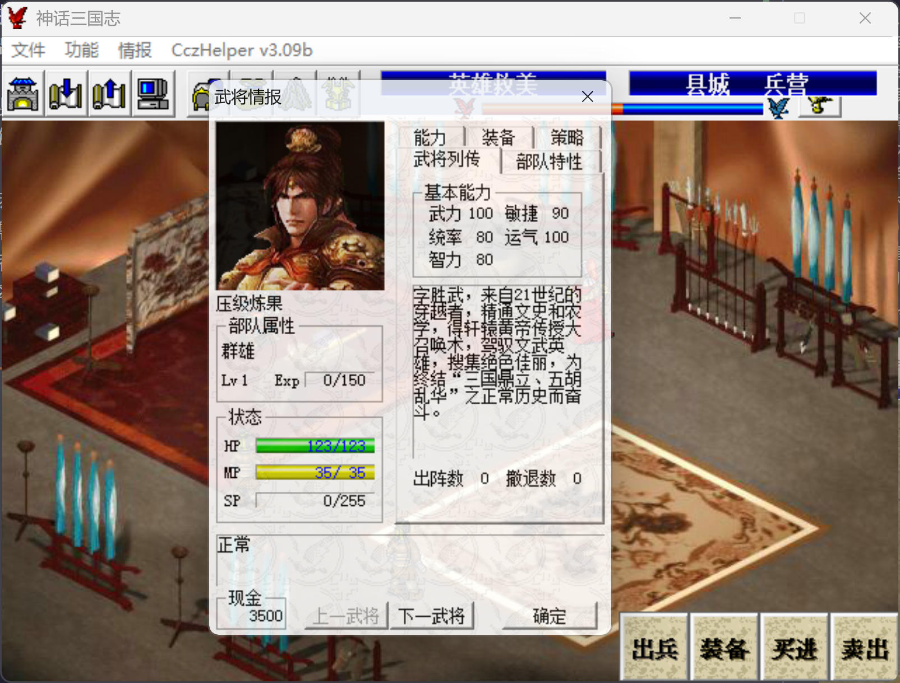

R0 主角初始450的能力分配，跟果子的生产难度和其他人的需求有关。

- 武力果可通过卖满级枪、炮车得到，运气果可通过卖满级弓、棍得到。都是武器，很难练，毕竟我军不出手，所以武力、运气都要100。
- 统率果可通过卖满级铠甲、锤得到，智力果可通过卖满级袍服、扇、宝剑得到，敏捷果可通过卖满级仙衣、刀得到。这三种果子我军可以靠挨打练，其中智力果最好练，因为果子产出大户潘大帅可以穿袍服，统率果次之，人肉经验书鲁大师可以穿铠甲，敏捷果相对难练。

从需求量上看，统率果需求不大，猛将的防御一般也是100+，智力果需求最大，看看八戒、裴元庆、李存孝的智力，敏捷果居中

升到2级：主角第一个（拒马水挑完公孙瓒），张飞第二个（梁山主要物理输出），猴哥第三个（金光阵挑完风后），高长恭第四个（娶亲关打第一波红颜军），岳飞第五个（宛城挑完吕布）

猴哥（5智）、张飞（9智 1敏）、高长恭（5智 8敏 10运）、岳飞（1智 10敏 6运），其它都在吃果都在中后期，综合考虑下来统率、智力80，敏捷90

    

S0 桃源村之战

战前买件麻布衣，大帅带倚天剑、麻布衣、三略练装备，雒阳2八戒单挑邹氏需要8级倚天剑，否则双击秒不掉，所以这里就抓紧练起来，后面得到金箍棒龙胆枪就没空练了

大帅一般情况下都不穿黄金甲，直接穿店货袍服就行了，被打残了就吃豆子，后面有了龙胆枪和中高阶店货袍服，敌军压根打不动，大帅是智力果的产出大户