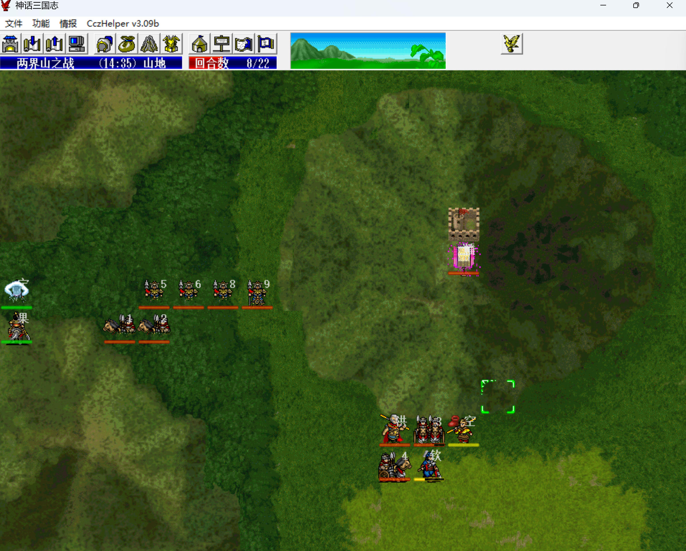
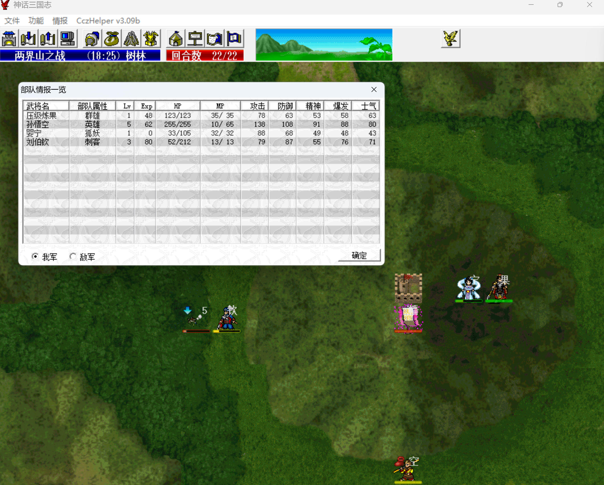
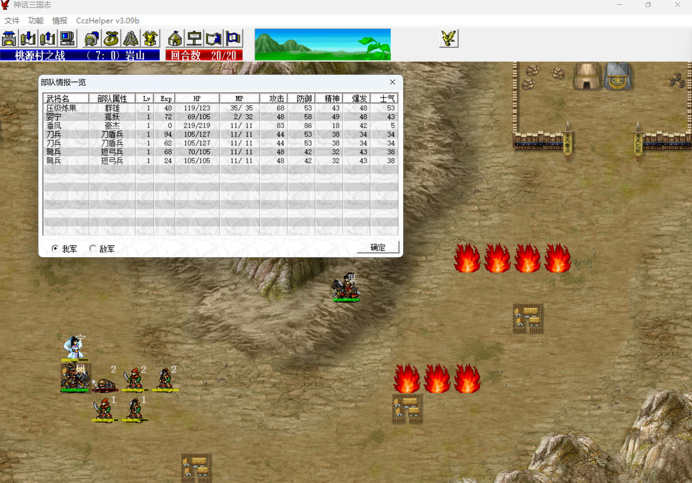

R0 主角初始450的能力分配，跟果子的生产难度和其他人的需求有关。

|  武力果  |  统率果  |     智力果     |  敏捷果  | 好运果 |
| :------: | :------: | :------------: | :------: | :----: |
| 枪、炮车 | 铠甲、锤 | 袍服、扇、宝剑 | 仙衣、刀 | 弓、棍 |

- 武力果、好运果只能通过卖满级武器得到，很难练，毕竟我军不出手，所以武力、运气都要100。
- 统率果、智力果、敏捷果可通过卖满级防具得到，这三种果子我军可以靠挨打练。智力果最好练，因为果子产出大户潘大帅可以穿袍服，统率果次之，人肉经验书鲁大师可以穿铠甲，敏捷果相对难练。

从需求量上看，统率果需求不大，猛将的防御一般都是100+，智力果需求最大，敏捷果居中。

升到2级：主角第一个（拒马水挑完公孙瓒），张飞第二个（梁山主要物理输出），猴哥第三个（金光阵挑完风后），高长恭第四个（娶亲关打第一波红颜军），岳飞第五个（宛城挑完吕布）。

猴哥（5智）、张飞（9智 1敏）、高长恭（5智 8敏 10运）、岳飞（1智 10敏 6运），其他吃果都在中后期，综合下来统率、智力80，敏捷90。

S0 桃源村之战

战前买件麻布衣，大帅带倚天剑+麻布衣+经验书练装备，雒阳2八戒单挑邹氏需要8级倚天剑，否则双击秒不掉，所以这里就抓紧练起来，后面得到金箍棒、鬼神枪就没空练了。

大帅一般情况下都不穿黄金甲，直接穿店货袍服就行了，被打残了就吃豆子，有了鬼神枪和中高阶店货袍服，敌军压根打不动，大帅是智力果的产出大户。

本关敌军很菜，友军就能杀光，所以关键就是拖，拖到最后一回合，否则浪费了经验书。

    
    

第一波两个友军骑兵不能让他们死得太快，否则大帅被四面围住就失去机动了。

婴宁可控后，可以心控一个黄巾兵，本关婴宁还是友军，可以得经验，之后和主角往右上走。

（13，6）-（18，12）矩形范围内敌军人数 >= 3，才会引出第二波友军，所以拉敌军贴着山脚下来，不要早早把友军放出来。

第12回合，时间差不多了，主角进右边村庄引出第二波友军，敌军混乱、定身、降防，友军开始收割。

第20回合友军击退最后一个敌军过关。

本关：

- 1级主角剧情单挑3级程远志得48点经验，1.0 => 1.48。

    

