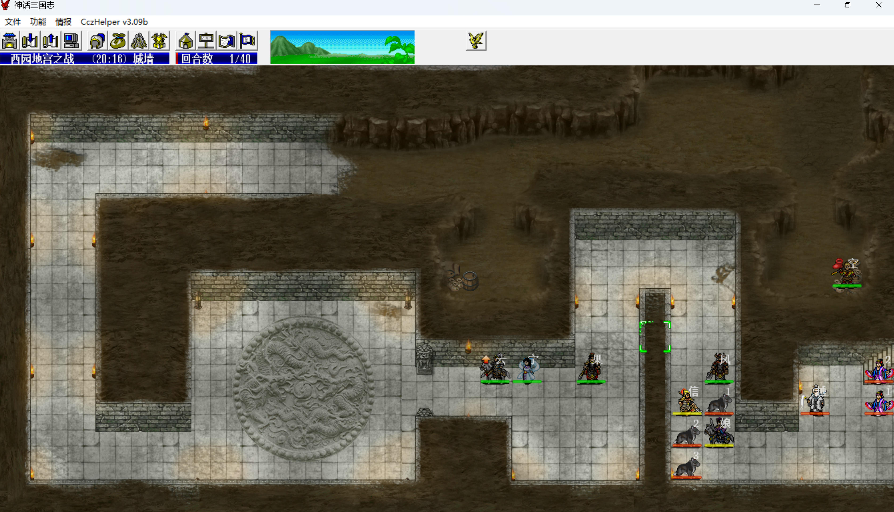
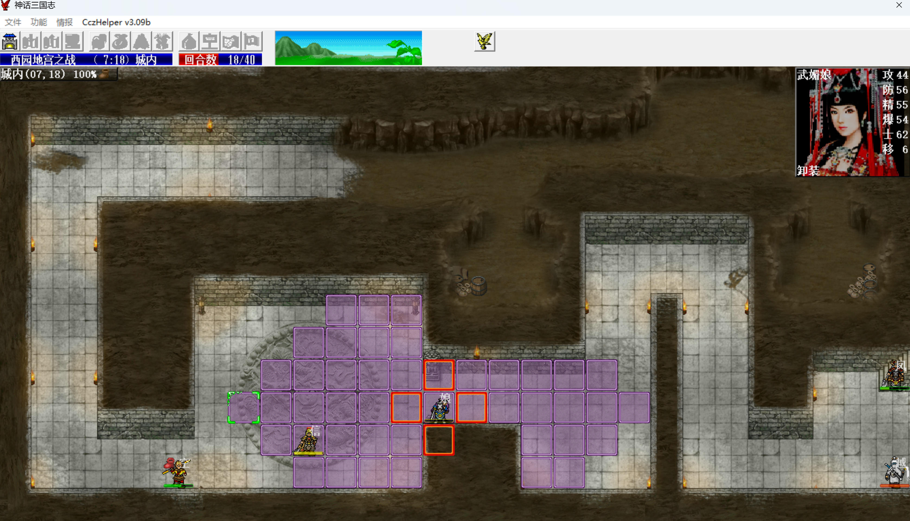
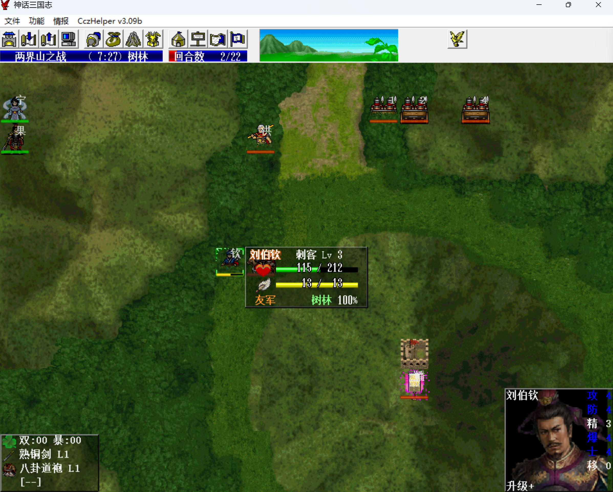
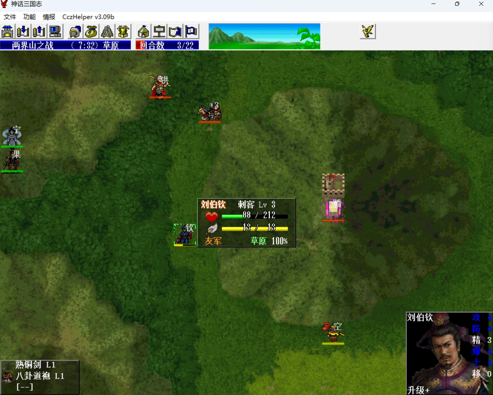
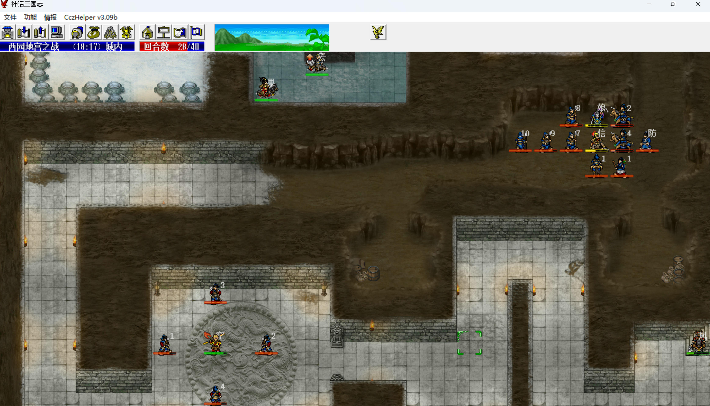
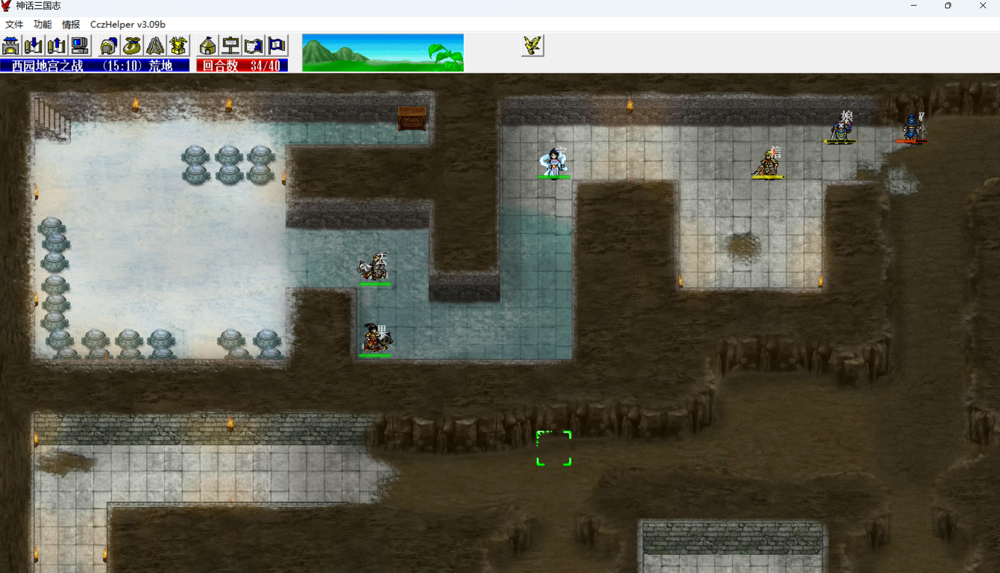
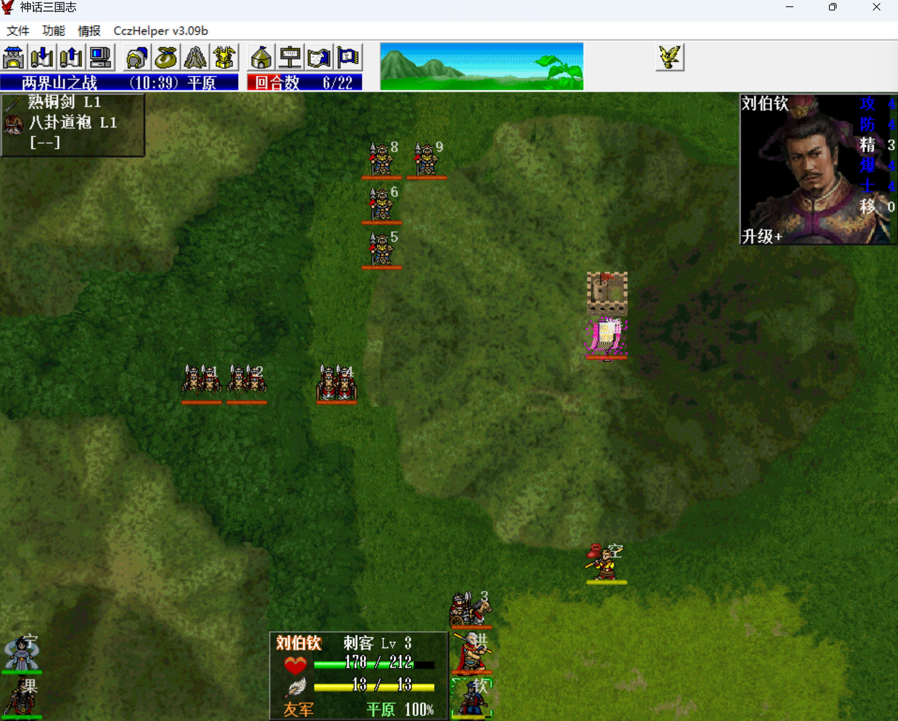
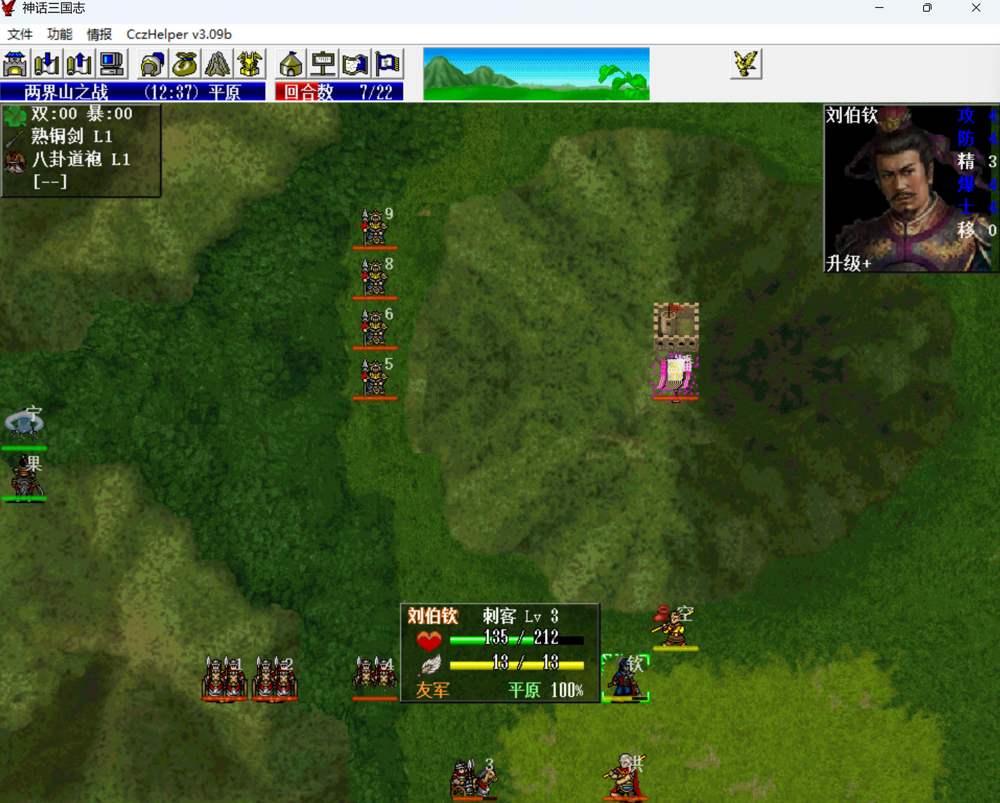

R2的单挑全部吃豆耗过去，sl敌军命中猴哥的次数多些，格挡多了太亏，商人处选择买乾坤圈。

S2 西园地宫之战

本关三略给猴哥练金箍棒，经验书必然练宝物武器（唯一例外是虎牢关练2把5级高阶店货扇，梁山要用），即便韩信再给一本经验书，加上后面的鲁大师，宝物武器也练不过来，宝物防具可以靠挨打练。

本关完全靠韩信、武则天打，武则天的换血是核心输出，大帅带黄金甲定王越。

第1回合，大帅下移和韩信、武则天围住一只狗，敌军ai设定是一旦被我军围死无法移动就会按固定的方向顺序物理攻击，连众矢之的都无视，这样狗不打大帅、只打武则天，其它人向左跑路
敌军阶段，三狗加一美女恰好会将武则天打残，有时候会打死，需要sl一下，因为总的基础伤害基本就是武则天的血量。

第2回合，武则天换血一只狗回满血，本关的基本模式就是武则天卖血、换血。

    
    

对第二波敌军，如法炮制。

第18回合，猴哥提前卡好位，武则天一动引出第三波敌军，韩信回归武则天，武则天二动换血潘隐。

敌军阶段武则天反死潘隐。

第19回合，武则天跑路，韩信到武则天的位置。

第20回合，韩信也跑路，第三波敌军就不打了。

    
    

第26回合，引出第四波敌军，这波敌军只能硬打，多用换血，猴哥下来找第三波的弓箭兵练甲。

    
    

第34回合，武则天提前残血，一动引出曹操三人组，婴宁提前等夏侯惇单挑。韩信回归武则天，武则天二动换血曹操，卡死曹操的位置，敌军阶段直接反击带走。夏侯渊没啥威胁，可以不用管。

    
    

第40回合，武则天一动引出袁绍部，赵云提前等文丑单挑，韩信回归武则天，武则天二动到指定位置过关。

本关0经验。

    

