R3 韩信、武则天加入，得到第二本经验书，收八戒，过场剧情在集市买一次负能量（800金）保证将来收陈丽卿，单挑吃豆子耗满回合，出战准备界面商人处买紫绶仙衣（全防御45%）。

S3 雒阳之战1

本关两本经验书练金箍棒、鬼神枪，青城山需要高级金箍棒打驼龙、法海，河间、陈仓需要高级鬼神枪。

击退张角前，驼龙无限复活，所以需要大帅定驼龙，为了避免得反击经验，大帅开场带店货甲，被大象混乱后，其他人给大帅再换上黄金甲，大帅武器带鬼神枪（不那么容易死），辅助带经验书。

灵帝有十字穿透，120%地形，要用起来，本关曹操三人组+灵帝输出打满，再加上袁绍部，差不多正好40回合可以击退所有敌军。

第1回合，大帅、八戒把敌军拉上去，黄巾兵都是无反攻击，只有张燕是个刀盾兵，要让他到斜角打大帅，这样不反击，其它人下行，猴哥下去拿道具。

敌军阶段大帅被打残，拉住张燕。

    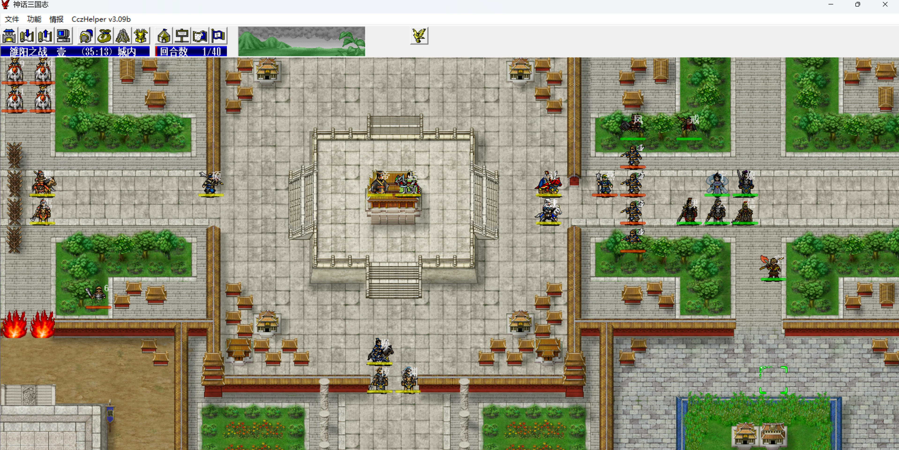
    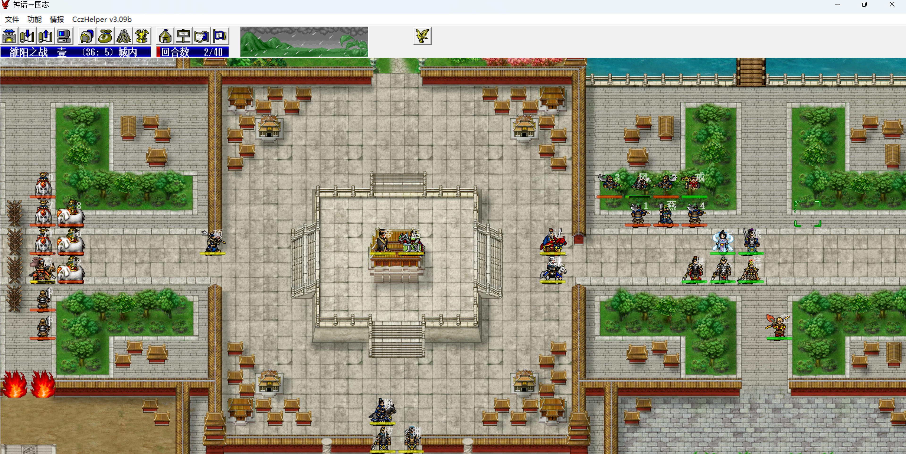

第2回合，主角进城，韩信回归主角对话灵帝，否则来不及第3回合对话曹操。

武则天、大帅夹住张燕，不让他乱跑，八戒下来，其他人进城。

大帅再次被打残。

    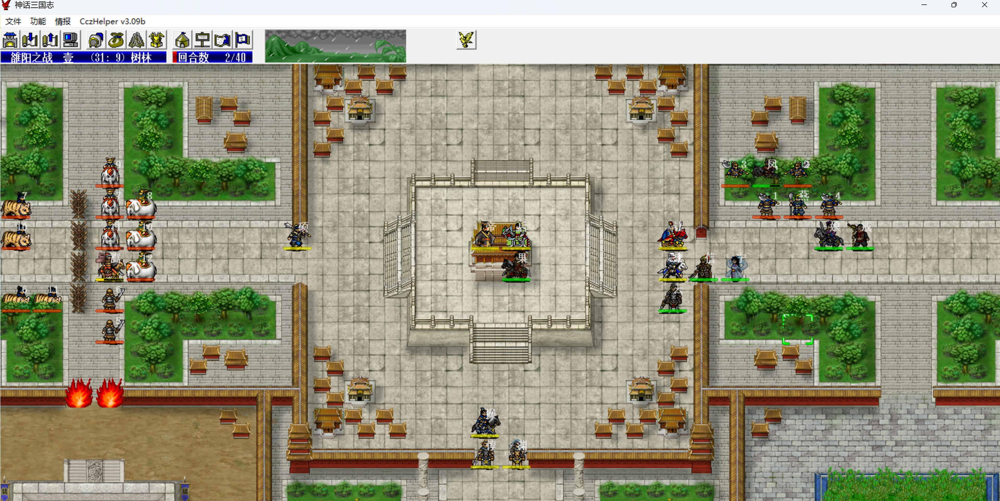
    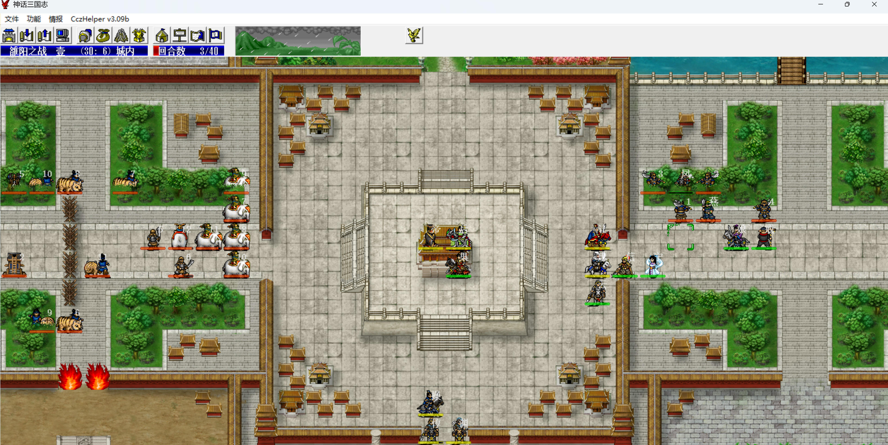

第3回合，主角对话曹操，曹操三人组变为可控，夏侯兄弟上来准备对付左边的敌军。

曹操留在下面卡门同时给武松涂双倍，曹操有反弹异常，所以是不怕井阑降防、大象混乱的，第5回合猴哥放大招后，敌军小兵几乎都残血了，曹操一刀一个，所以现在没必要攻击那两个黄巾兵，给我军涂双倍就行了。

武则天、八戒往内城走，大帅往右上走，猴哥放大招敌军被混乱、定身后，再进内城。

第4回合，左边大象冲进来了，夏侯渊先贪一刀伤害，曹操给婴宁涂双倍。

    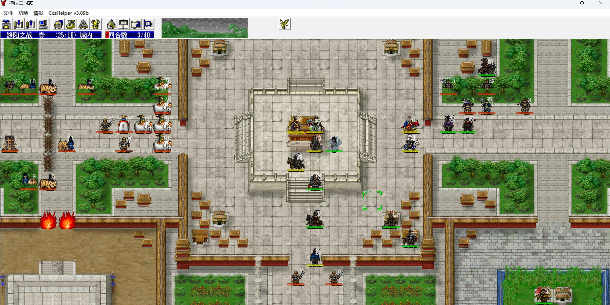
    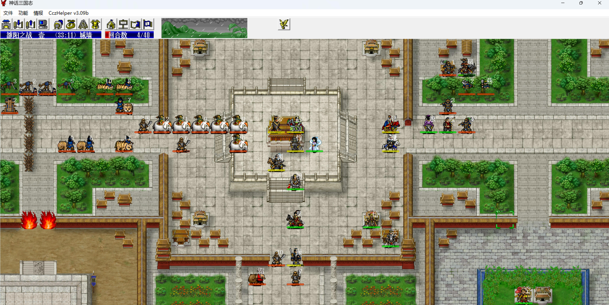

敌军阶段曹操要扛巨无霸一刀，sl倚天格挡掉。

第5回合，猴哥大招，敌军混乱、定身、降防、hp-100，曹操给韩信涂双倍，之后上路八戒带武松、婴宁、韩信3个八向攻击不善卡位的武将去找炮车练甲。

夏侯渊击退曹操左边的黄巾兵，赵云单挑巨无霸，夏侯惇去左边打老虎，大象交给灵帝去打，张让、赵忠把两个黄巾兵击退，大帅下来抓紧进内城，猴哥拿完袁绍家的钱就往中间走。

sl左边两个井阑、大象异常都不解，至少得不能移动。

第6回合，赵云后撤，武则天单挑巨无霸，夏侯渊收掉巨无霸，曹操到巨无霸的位置秒左边的医生，医生一旦恢复，敌军就都恢复了，所以抓紧秒医生。

    
    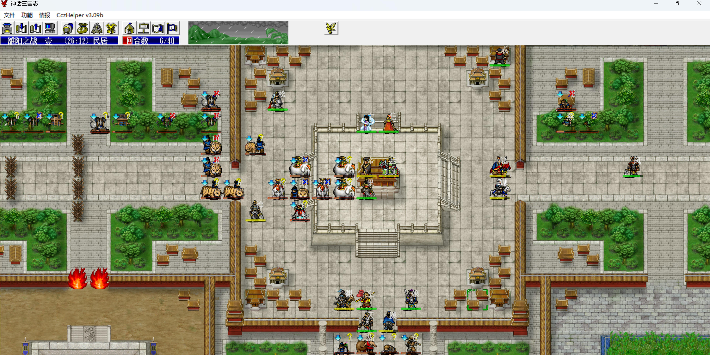

第7回合，武则天后撤，夏侯渊收掉曹操下面的黄巾兵，曹操下移一格收掉另一个医生。

上路练甲的人准备结阵，大帅进内城，猴哥去左边的院子准备引狐妖。

    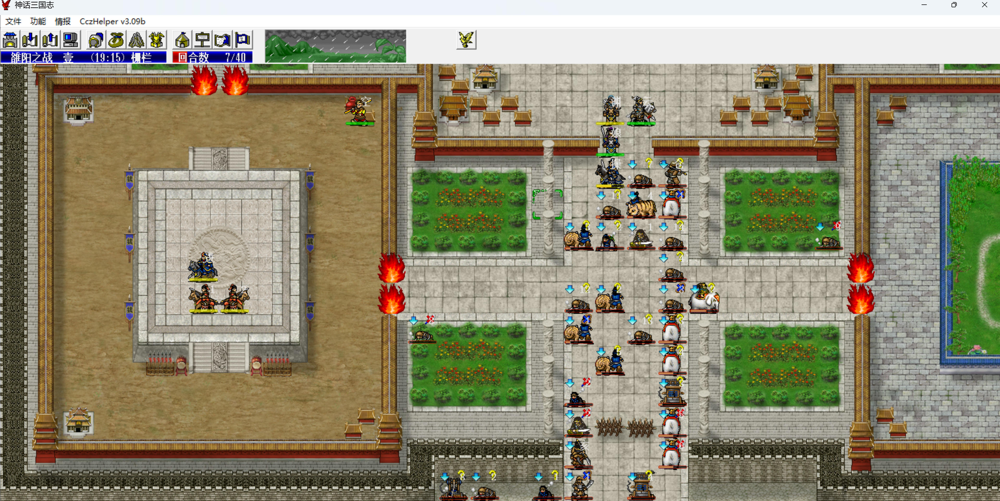
    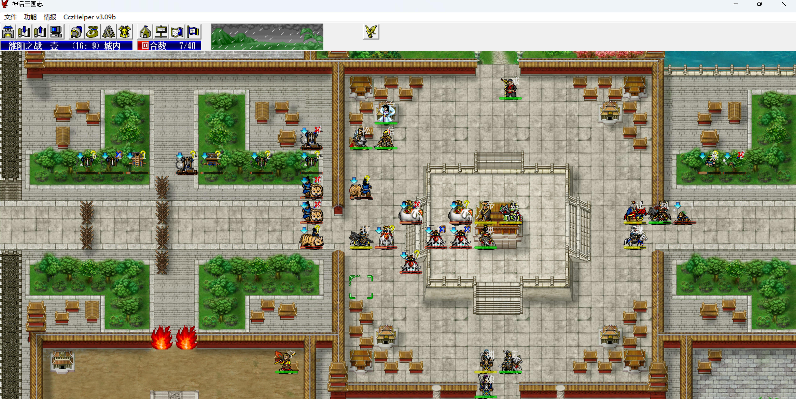

第8回合，猴哥提前走位，准备拉城外的狐妖兜圈子，狐妖早早进城的话，会妨碍夏侯惇去杀井阑。

第10回合，大帅被大象攻击并混乱，但何皇后有11mp，会放一次清醒，所以要下一回合大帅第2次被攻击混乱后才能换黄金甲，猴哥在左边拉住狐妖，夏侯惇抓紧清老虎，下面的驼龙也上来了，抓紧把它们拉到大帅身边。

    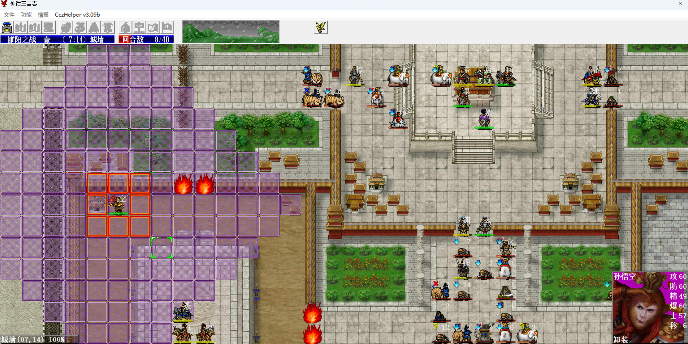
    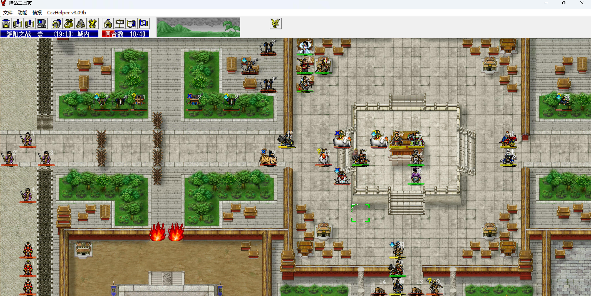

第11回合，夏侯惇清完了全部老虎，猴哥进左边院子拿钱，狐妖和阴阳师掉头进城。

第13回合，夏侯惇收掉2个井阑后把狐妖和阴阳师放进内城，夏侯渊比较脆，容易吸驼龙，多利用他做跳板，把远处的驼龙往大帅这边拉。

    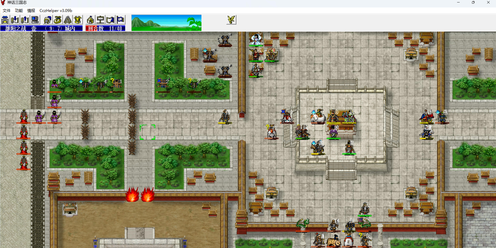
    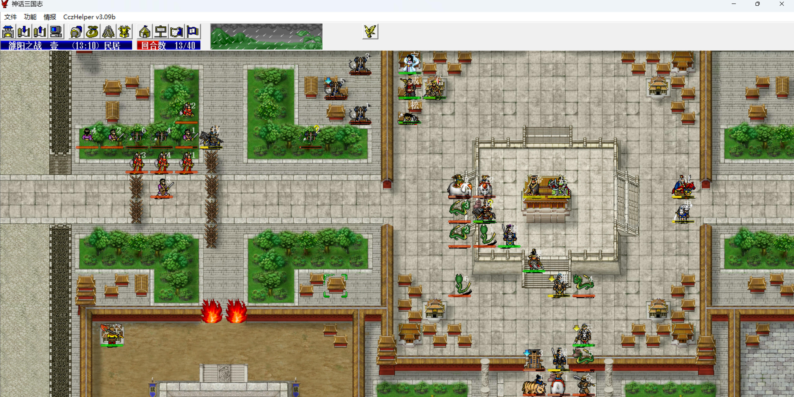

第17回合，夏侯惇把敌军卡成适合灵帝攻击的阵型。

第27回合，下路清得差不多了，曹操、夏侯惇下去杀张角，张角穿了无缝，曹操可以反弹破防，杀起来并不难。

    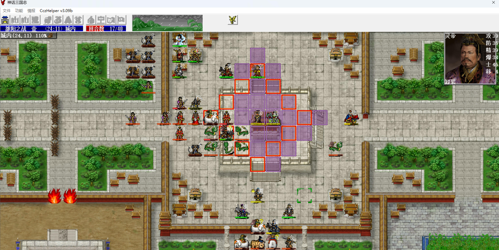
    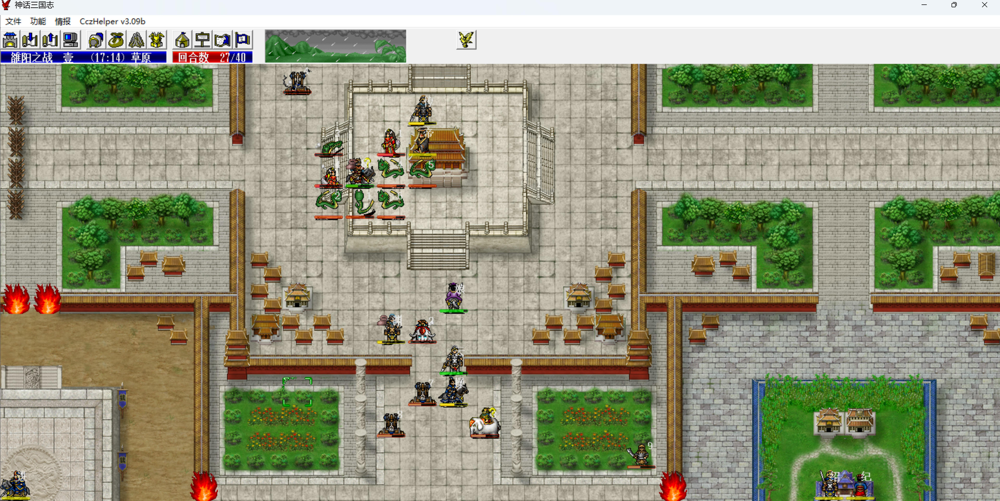

练甲的人下移，把外面的5个炮车拉2个进城，这样6个炮车全部攻击八戒，最大化练甲效率。

第32回合，曹操击退张角，敌军人数<15，袁绍部开始出击，之后就很简单了。

    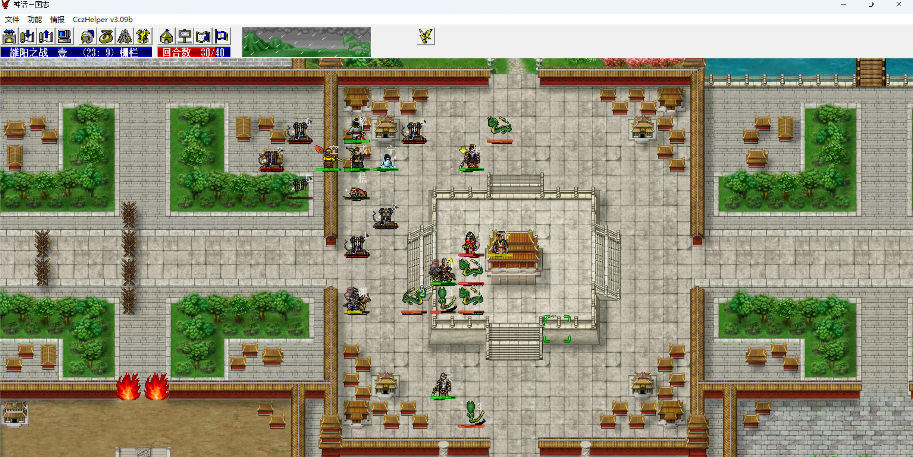
    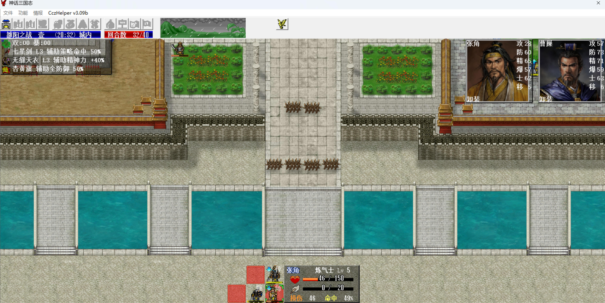

注意把炮车多留一会儿练甲。

本关：
- 1级主角剧情单挑1级管亥得32点经验，1.48 => 1.80。
- 1级韩信回归1级主角得10点经验，1.0 => 1.10。

    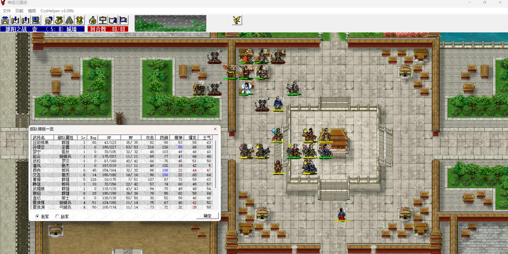

