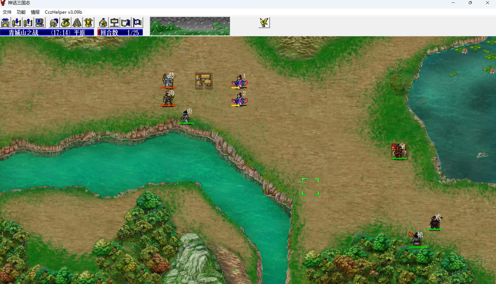
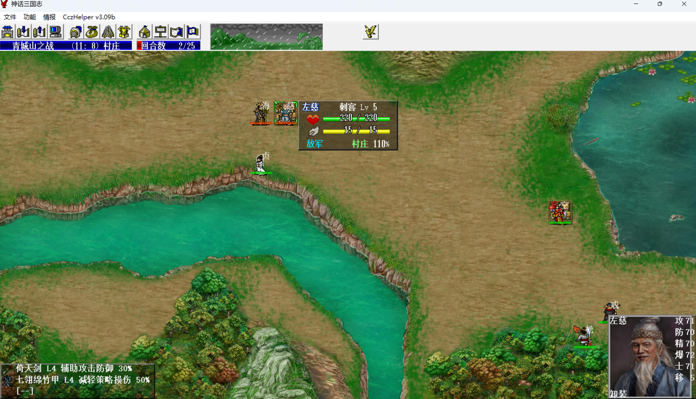
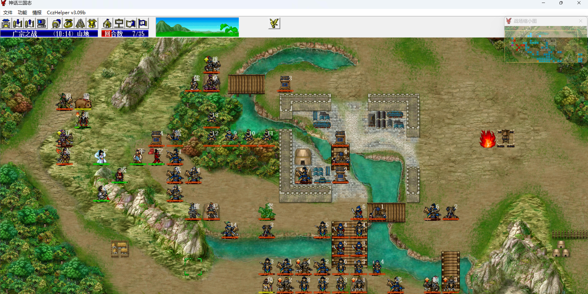
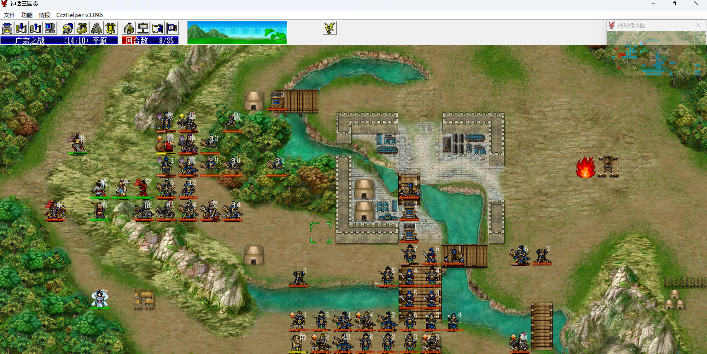
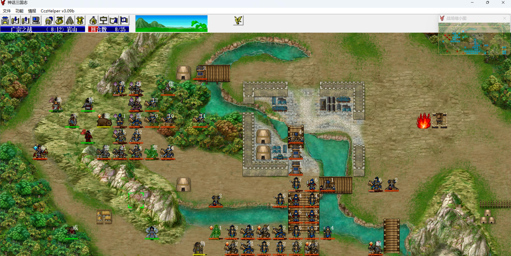
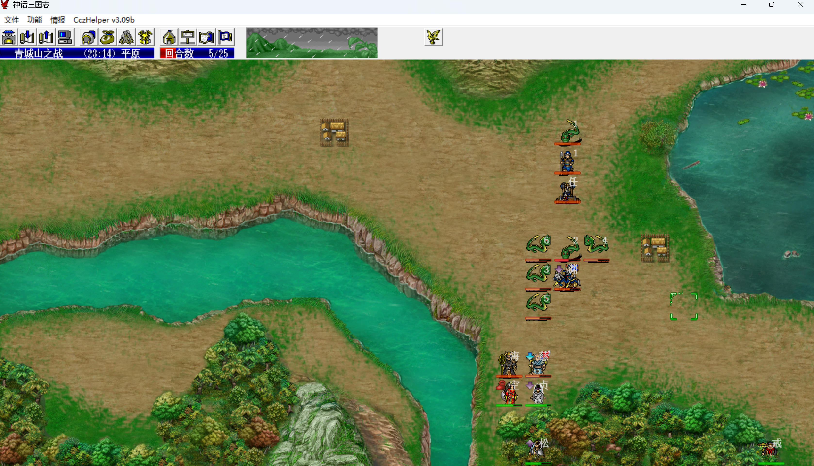
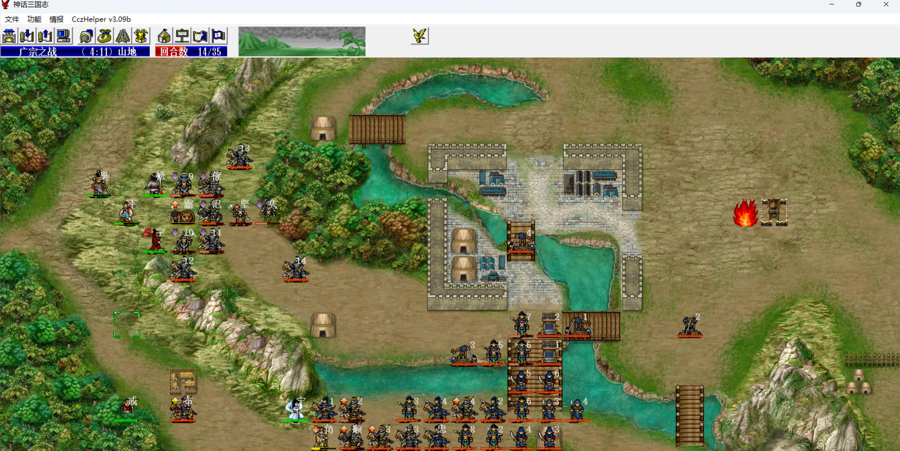
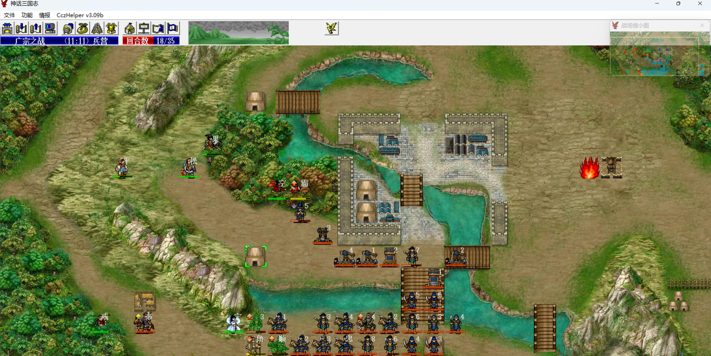
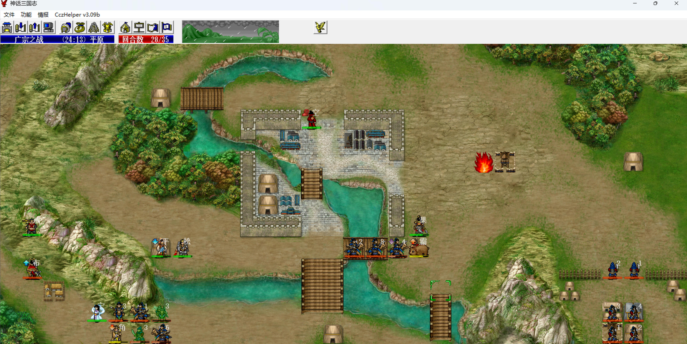
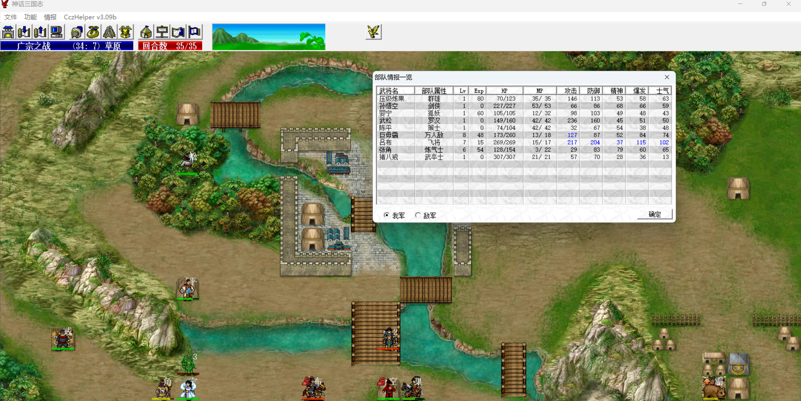

S4 广宗之战

本关两本经验书继续练金箍棒、鬼神枪，猴哥变剑侠卡位，（19，8）的米应该在（19，0）。

刘、关、张、吕布、张辽5个人，吕布靠婴宁心控，其他4个靠吕布打。

前5回合，我军全速左移，猴哥给陈平殿后。

第5回合，武松蹲好单挑张飞的位置，八戒到（7，9）把吕布拉到（7，7），这样吕布奋战不到张角小弟，敌军阶段还要靠这个小弟拖住刘、关、张、张辽一回合，我军才能不得反击经验。

敌军阶段，刘备吹风八戒，吕布攻击八戒，张辽、关羽秒掉一个张角小弟，张飞秒掉另一个张角小弟。

    
    

第6回合，婴宁心控吕布，吕布奋战秒掉张飞、刘备，打残张辽，注意要先攻击张飞，先攻击刘备的话张飞就有一夫当关了，也不要把张辽打死，否则下一回合没法奋战破关羽先手了。

张角在下面堵路，顺便毒上孙坚，孙坚穿的3级黄金甲，没羽箭攻击，巨无霸打他很费劲，也反击不到他，所以靠毒先耗他血。

敌军阶段，张辽、关羽去欺负不会打斜角、山地只有90%的主角。

第7回合，主角对话关羽，吕布奋战秒掉张辽、关羽。八戒去左下，敌军阶段把吕布拉过去，让他奋战不到我军其他人。

巨无霸吃武力果前出等反击，婴宁过来配合教主卡死下路，教主洞烛先机吸mp，教主mp上限天残，只能一吸一毒。

    
    

第8回合，上路皇甫嵩混乱攻击，不用主动打他，每回合sl不被他混乱即可，下路同时还要sl背嵬军的毒不解。

巨无霸、猴哥、武松把上路卡死，巨无霸顶在最前面强反输出，武松穿高级紫绶，敌军只会打巨无霸，不要相互挨着，会被井阑破防，下路张角且战且退，毒背嵬军。

巨无霸主动攻击打远程，近战靠反击。

第11回合，皇甫嵩已残，巨无霸收掉。

    
    

第14回合，上路只剩近战了，巨无霸后撤一格让敌军无法围攻，巨无霸打敌军小兵2刀一个，所以只要不被围攻，两轮强反可以全部带走。

第18回合开始，巨无霸主动出击，引下路的炮车和井阑过来，一回合双击杀1个远程，近战2次强反杀一个。

    
    

第28回合，左下还剩5个敌军，巨无霸去右下，几个尾巴靠反击杀死。

第34回合，婴宁心控吕布，单挑猴哥。

第35回合，击退最后的敌军过关。

    
    

本关：
- 1级婴宁心控5级吕布、7级吕布各一次，得10+4\*4+10+4\*6=26+34=60点经验，1.0 => 1.60。
