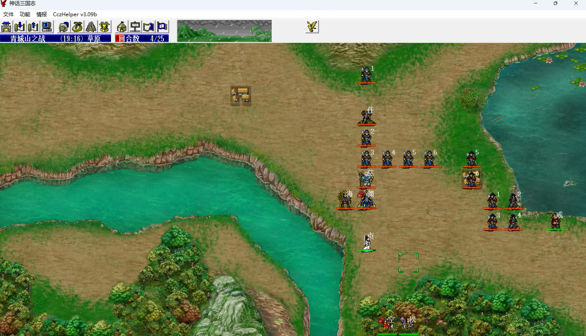
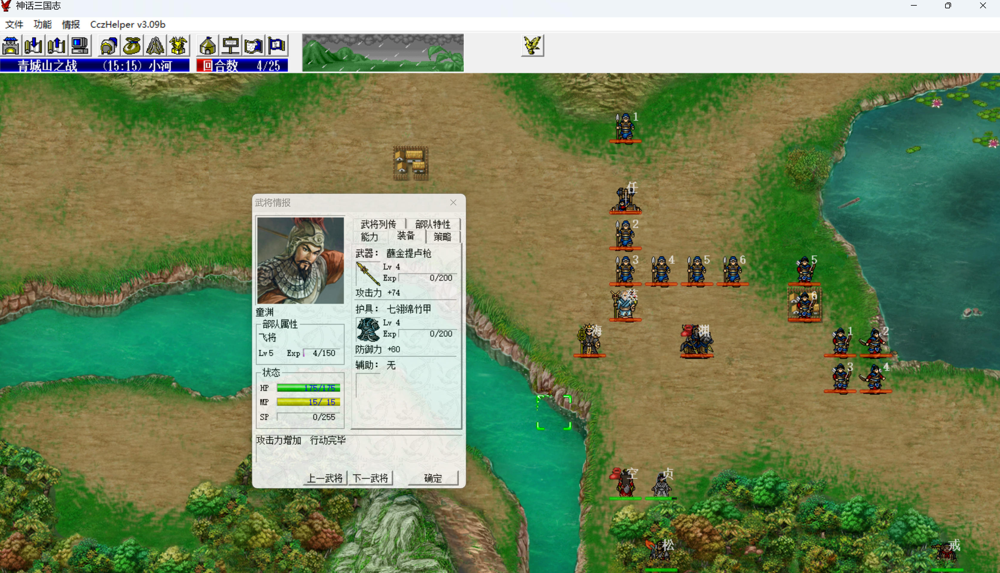
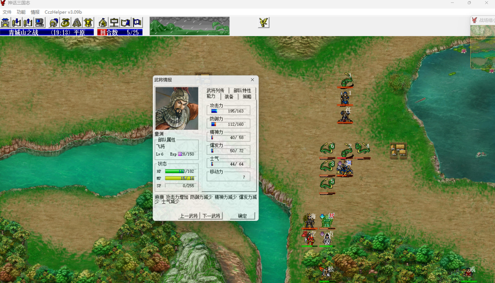

S5 青城山之战

本关没有友军，只能靠我军自己，出场武将也很少，目前还没有穿透武器和群攻法术。敌军童渊有先手，法海混乱攻击，张任是炮车有穿透，因此只能是猴哥变狐妖，心控童渊先手清武斗兵、步弓，心控法海混乱攻击定住驼龙，最后2回合心控炮车张任带走所有被混乱的敌军。

武松带金箍棒+乾坤圈，猴哥带破甲刀、不要带倚天剑，否则法海很难打中猴哥。经验书练破甲刀、倚天剑，金箍棒目前6级，本关已经够用，后面直到猴哥单挑风后才需要9级金箍棒。

第1回合，白素贞对话法海，猴哥拿道具。

    
    

敌军阶段两个友军必死，sl左慈的位置靠右下一些，至少跟村庄在一条斜线上，否则第5回合猴哥没法和他单挑，杀了他后才好杀驼龙。

第2回合，白素贞、猴哥向下走，八戒留在原地把步弓往右拉，否则他们会直接向下。

第4回合，形成下面这个局面就拉怪成功了。

    
    

猴哥心控童渊，童渊吃武力果加攻击buff，不吃先手秒不掉武斗兵。

八戒离开弓箭兵一动攻击范围，这样他们会转头来打童渊，被先手秒掉。

武松穿低级防具引左慈过来。

白素贞到猴哥右边一格换上等级高一些的防具，白素贞六丁六甲+100防

。

敌军阶段，左慈召唤驼龙，白素贞剧情被混乱。

左慈向下走到底攻击武松，触发和猴哥的单挑，降防、hp-100。

法海向下走到底攻击猴哥（白素贞六丁六甲+100防、圣兽地形优势），sl命中并混乱猴哥，这样不反击。

敌军阶段，童渊先手清掉所有步弓，武斗兵也只剩一个最远的来不及过来的。

sl童渊武力不被debuff、sl白素贞混乱自动解。

    
    

第5回合，猴哥心控法海，白素贞给法海吃武力果，sl法海双或爆收掉左慈，sl童渊双或爆收掉左下离我军最近的驼龙。

敌军阶段，白素贞六丁六甲+100防，驼龙会来打法海，sl法海混乱驼龙

童渊变回敌军，sl他定身不解。

白素贞因为敌军阶段，驼龙会来打法海，sl法海混乱驼龙，这里是最关键的一回合，跟我军要得多少经验息息相关，能被混乱的驼龙都是不用我军吃人头经验的
童渊收掉1条驼龙后，最多会有4条驼龙来攻击法海，由于童渊、法海都吃了武力果，如果有驼龙被他俩打中的话，就重残了，其他驼龙会放弃攻击法海，改为给残血驼龙加血，所以要想混住全部4条驼龙，只有第1条攻击法海的驼龙出双击，直接debuff法海攻击，法海打不出伤害，同时法海的4刀反击全部命中且混乱，这概率太低了。

实战混乱住3条驼龙。

第6回合，法海混乱且重伤武斗兵，这样敌军阶段法海变回敌军会给这个武斗兵加血，否则给驼龙解混乱就很烦。

敌军阶段，6号驼龙攻击武松，被双爆反击带走。

第7回合，武松将双暴击套装交给白素贞，白素贞带走法海，敌军阶段反击收掉4号驼龙。

之后白素贞换上3级倚天剑，利用地形（120%平原、110%草原、100%水池）、侧后伤害加成、无缝破防、乾坤圈双击等各种因素，调整伤害4刀普攻将4个混乱的敌军压到张任一刀秒的血量
第24回合，猴哥心控张任，2回合收掉4个混乱敌军，武松对话童渊使其撤退过关，白素贞提前去左下拿道具

本关猴哥心控5级童渊、5级法海、1级张任得(10+4*4)*2+10=62点经验，1.0=>1.62
武松击退1个4级驼龙得38+2*3=44点经验，1.0=>1.44
白素贞击退1个4级驼龙得38+2*3=44点经验，击退5级法海得38+2*4=46点经验，3刀普攻4级驼龙得(6+2*3)*3=36点经验，1刀普攻1级武斗兵得6点经验，一共132点经验，1.0=>1.132
八戒不得经验
一些选择：
1. 如果第5回合敌军阶段法海可以定住4条驼龙，则武松的44点经验可以不得，白素贞再多得一刀普攻4级驼龙的12点经验，整体少得32点经验
2. 武松后面梁山挑鲁智深、金光阵挑罗宣、丹徒山挑三国名将、冉闵救援挑沙摩柯就到5.110了，如果这里再多吃一个人头，后面挑完沙摩柯就到6级了，这样最后蚩尤旗敌军会到18级
3. 白素贞最后4刀普攻的42点经验可以分摊一些给八戒，但八戒只能拿倚天剑和破甲刀，且这俩目前等级都低，所以八戒打不出伤害，还得具体看情况凑，不过即便凑上了也影响不大，白素贞最后是4.70，很难靠这里的凑压到3级以内