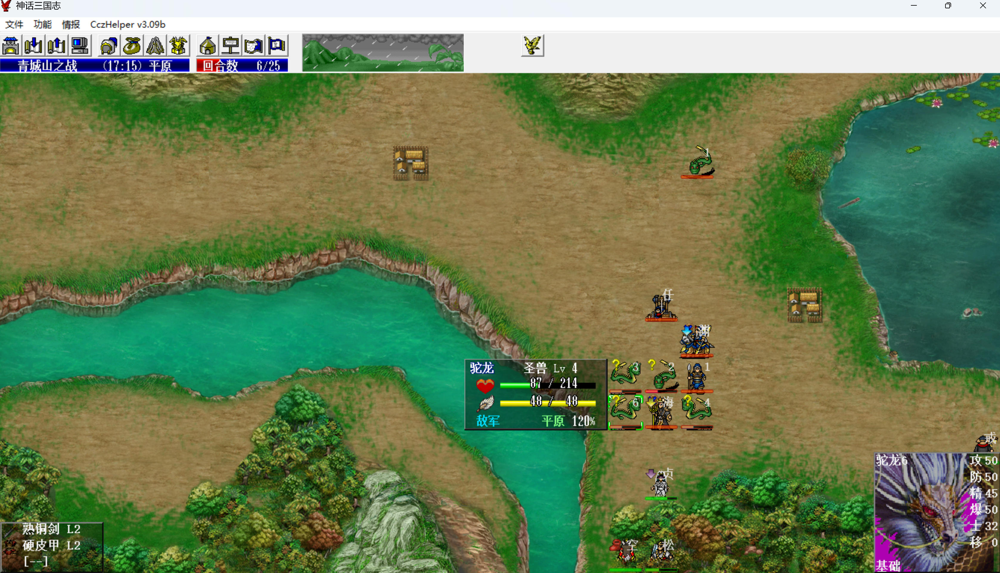
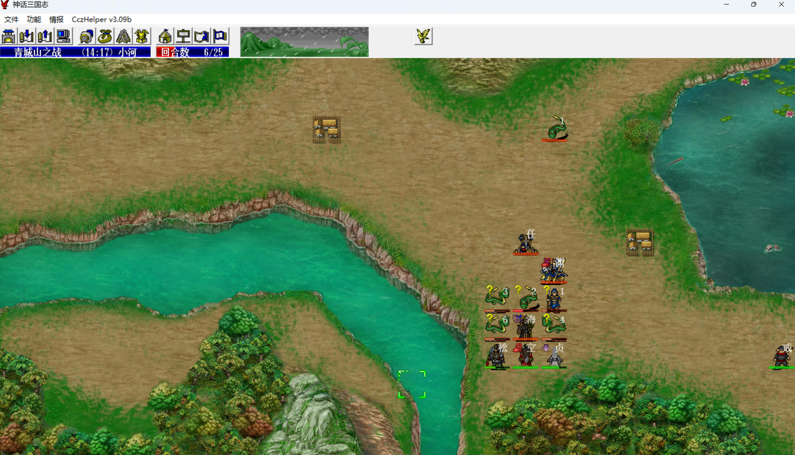
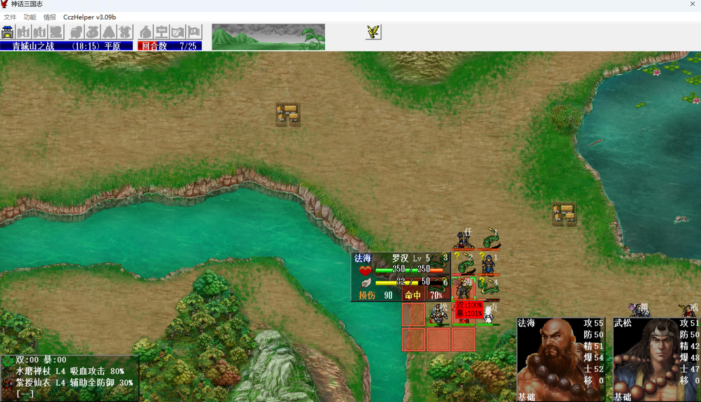
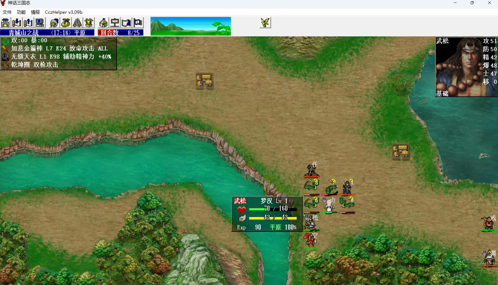
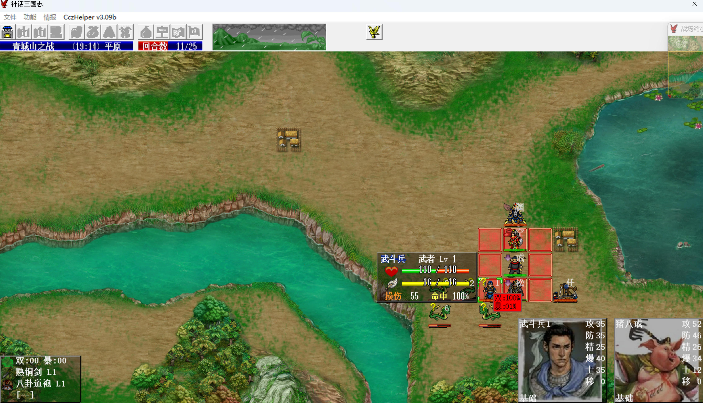
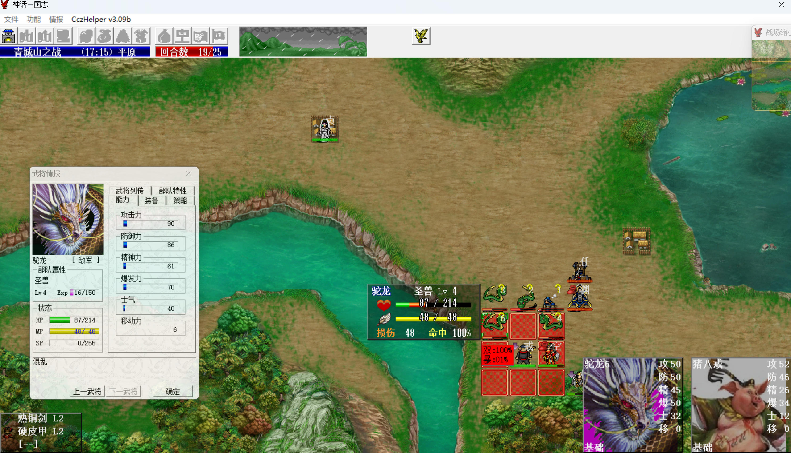
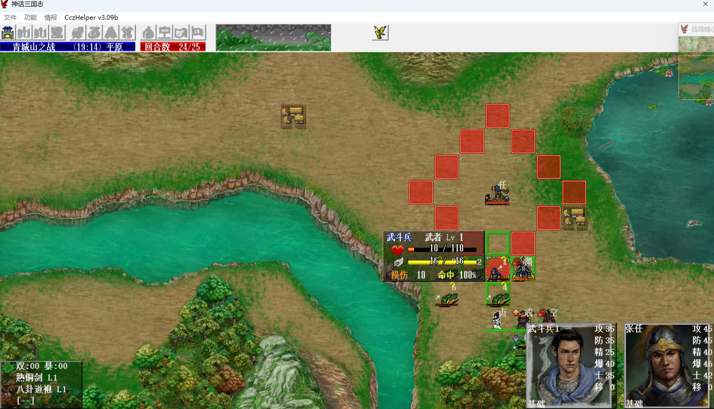
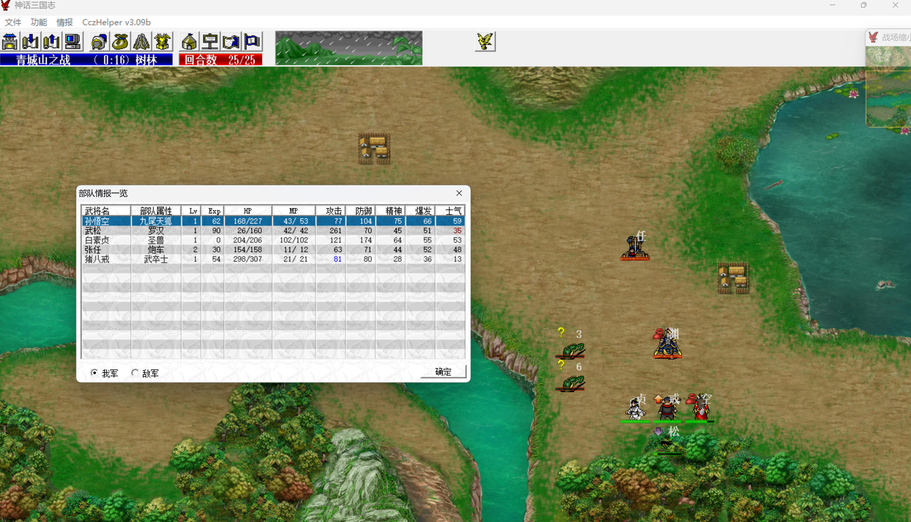

S5 青城山之战

本关没有友军，只能靠我军自己，出场武将也很少，目前还没有穿透武器和群攻法术。敌军童渊有先手，法海混乱攻击，张任是炮车有穿透，因此只能是猴哥变狐妖，心控童渊先手清武斗兵、步弓，心控法海混乱攻击定住驼龙，最后2回合心控炮车张任带走所有被混乱的敌军。

开场装备

- 武松：6.150金箍棒+1级无缝+经验书，第5回合金箍棒升到7级就够用了，后面直到猴哥单挑风后才需要9级金箍棒。
- 八戒：3.26倚天剑+店货甲+经验书。
- 猴哥：1.0破甲刀+5级紫绶+乾坤圈。

第1回合，白素贞剧情单挑法海，猴哥拿道具。

    
    

敌军阶段，左慈、法海各击退一个友军，sl左慈的位置靠右下一些，至少跟村庄在一条斜线上，否则第5回合猴哥没法和他单挑，击退他后才好击退驼龙。

第2回合，白素贞、猴哥向下走，八戒留在原地把步弓往右拉，否则他们会直接向下。

第4回合，形成下面这个局面就拉怪成功了。

    
    

猴哥心控童渊，童渊吃武力果加攻击buff，不吃先手秒不掉武斗兵。

八戒离开弓箭兵一动攻击范围，这样他们会转头来打童渊，被先手秒掉。

武松穿1级无缝，防最低，引左慈过来，正好触发猴哥与他的单挑。

白素贞到猴哥右边一格。

敌军阶段，左慈召唤驼龙，白素贞剧情被混乱。

左慈向下走到底攻击武松，触发和猴哥的单挑，降防、hp-100。

法海向下走到底攻击白素贞。

童渊先手清掉所有步弓，武斗兵也只剩一个最远的来不及过来的，之后驼龙围上来，sl童渊武力不被debuff、sl白素贞混乱自动解。

    
    

第5回合，猴哥心控法海，白素贞给法海吃武力果，sl法海双或爆收掉左慈，sl童渊双或爆收掉左下离我军最近的驼龙，八戒上移，准备拉走即将变回敌军的童渊。武松与猴哥交换辅助，装备乾坤圈。

敌军阶段，白素贞六丁六甲+100防，兼之圣兽地形优势，驼龙会来打法海，sl法海混乱驼龙。

这是本关sl量最大的一回合（我sl了一整天才出来），能被混乱的驼龙都是不用我军吃人头经验的。童渊收掉1条驼龙后，最多会有4条驼龙来攻击法海，由于童渊、法海都吃了武力果，如果有驼龙被他俩打中的话（童渊有辅助攻击命中，打驼龙必中）就重残了，其他驼龙会放弃攻击法海，转而给残血驼龙加血，所以要想混乱全部4条驼龙，必须是第1条攻击法海的驼龙出双击，直接debuff法海攻击，法海打不出伤害，同时法海的4次反击全部命中且混乱。

第6回合，sl法海双或爆混乱且重伤武斗兵，这样敌军阶段法海变回敌军会给这个武斗兵加血，否则他会给驼龙解混乱（驼龙是圣兽，4级圣兽还不会解状态）。

武松到法海背后（多10%伤害加成），白素贞或猴哥也到法海旁边，这样武松下回合可以围攻（多10%伤害加成）。

    
    

敌军阶段，sl 5个被混乱的敌军不醒（直到最后一回合）。法海给武斗兵加血。最后一只驼龙也下来了

第7回合，武松围攻法海，7级金箍棒暴击+无缝破防+乾坤圈双击+2个10%伤害加成，正好可以秒掉满血法海（水磨禅杖吸血攻击，所以上回合他遭驼龙围殴也不会掉血）。

敌军阶段，武松双暴击反击收掉唯一没被混乱的驼龙。

    
    

之后白素贞去左下拿道具。猴哥、武松挨着八戒站成十字，利用炮车张任的十字穿透练防具。

八戒3级倚天剑+乾坤圈双击，可以把武斗兵打到10血以下。

所有驼龙的剩余血量几乎相同，都是挨了童渊buff一刀和法海debuff一刀。等倚天剑升到4级，八戒吃武力果，双击恰好可以把驼龙打到4血以下（张任打驼龙的伤害就是4血）。

    
    

第24回合，猴哥心控张任，2回合收掉5个被混乱的敌军。

第25回合武松单挑童渊使其撤退过关（留着他是给八戒练防具）。

    
    

本关：

- 1级猴哥心控5级童渊、5级法海、1级张任得(10+4\*4)\*2+10=62点经验，1.0 => 1.62。
- 1级武松击退5级法海得38+2\*4=46点经验，击退1个4级驼龙得38+2\*3=44点经验，1.0 => 1.90。
- 1级八戒普攻4次4级驼龙得(6+2\*3)\*4=48点经验，普攻1级武斗兵得6点经验，1.0 => 1.54。
- 金箍棒：6.150 => 7.34，6回合经验书+围攻双暴击（16点经验）+双暴击反击（8点经验）。
- 倚天剑：3.26 => 4.56，20回合经验书+5次双击（30点经验）。
- 破甲刀：1.0 => 2.9，20回合经验书+3次心控。
- 店货剑：1.0 => 1.40，八戒拿倚天剑+乾坤圈压混乱敌军血量的5回合，经验书武松拿着练店货剑4回合，最后白素贞拿道具回来，练金箍棒1回合。

经验的分摊：

1. 由于走张飞线，梁山挑鲁智深只得水磨禅杖，没啥用，放弃；巨马水挑太史慈没有经验；魔火金光阵没有潘凤，也就没有挑罗宣；冉闵救援挑9级沙摩柯得38+2\*8=54点经验，到1.144，之后天门阵挑于吉，1级转战魔成长。
2. 猴哥要到寿春才能转英雄成长，白素贞2周目坂泉才能转金仙，所以安排八戒分摊54点经验，雒阳2挑5级邹月颖得38+2\*4=46点经验；宛城挑2级吕玲绮得38+2=40点经验，到1.140，之后再得经验得神都之后了，所以短期不会造成练果的压力。
