R10 1级高长恭、赵飞燕加入。高长恭兵种选群雄，4向方便卡位，能拿戒刀，能涂双倍，多面手。飞燕可以带10级倚天、低级防具，是扛近战敌军最好用的盾。

战前买足豆子，再买2个醒脑丸（解混乱）。本关雷震子大招，每回合我军除猴哥、八戒、白素贞外掉50血，雷震子最后一回合才会被击退，我军要靠吃豆子一直撑到那时候。

S10 雒阳之战2

本关有7个可控友军：

- 马超：3转蛮族骑，吸血攻击50%，突击移动抢有利攻击位置，破坏爆发增加自己双击率，辅助毕燕挝十字攻击增加伤害。
- 马云禄：蛮族骑，八向攻击，平原、草原110%，能用。
- 曹操：5级倚天剑（辅助攻击防御30%），反弹异常不怕背嵬军破攻，四向攻击有些受限，能给我军涂双倍。
- 颜良：随机状态攻击能种debuff，自动提防，八向攻击，平原110%，隐藏mvp。
- 文丑：自动提防，远程伤害-90%不怕后羿，四向攻击，草原、树林110%，凑活能用。
- 袁绍：四向攻击，物理伤害除少帝外垫底，吹风伤害在20左右，能给我军涂双倍。
- 少帝：12mp的策士，只够放2次策略，6士气+黄金甲物理免疫。

吕布、雷震子、石勒都是友军搞不定的，颜良破防、曹操拿5级倚天剑打他们伤害也是1。这仨里最强的是吕布（先手、奋战、自动提全能力、平原120%），因此倒数第2回合心控他，辅以颜良破防，2回合带走石勒、雷震子。

雷震子（5级禹王槊）近战连击、暴击，不吃防暴嘲讽，全地形移动，任由他走位的话，可以一回合击退一个我军。因此出剑侠猴哥（拿8级倚天剑），配合高长恭（鬼神枪、炎帝甲）、少帝（黄金甲），卡他走位。

开场装备

- 高长恭：鬼神枪+炎帝战甲。
- 猴哥：倚天剑+紫绶仙衣。
- 鲁班：丈八蛇矛+减策甲+经验书。
- 婴宁：破甲刀+经验书。
- 八戒：乾坤圈。
- 武松：低级麻布衣。
- 赵云：高级鱼鳞铠。

白素贞出生点放在最右，其次高长恭，再其次放6格移动的（鲁大师除外），鲁大师放在最左，他桥梁降移动。

第1回合，白素贞去（25，0）拿道具，其他人向左挤满，高长恭垫后，吕布自动提全能力，9格移动走到头正好打到他。

马超这边：马超先动，sl出双击增加伤害，本关回合数有点紧，抓紧输出不能拖。破爆后马云禄的双击率也会增加。八戒吸弓骑攻击，减轻马氏兄妹的生存压力。

曹操这边：颜良先动种debuff，曹操跟上打伤害，曹操士气比爆发高，袁术、孙坚士气比爆发低，所以debuff的优先级是防御、士气、爆发（攻击、精神没有用）。颜良破防、士后，sl曹操一个暴击就能收掉袁术。

    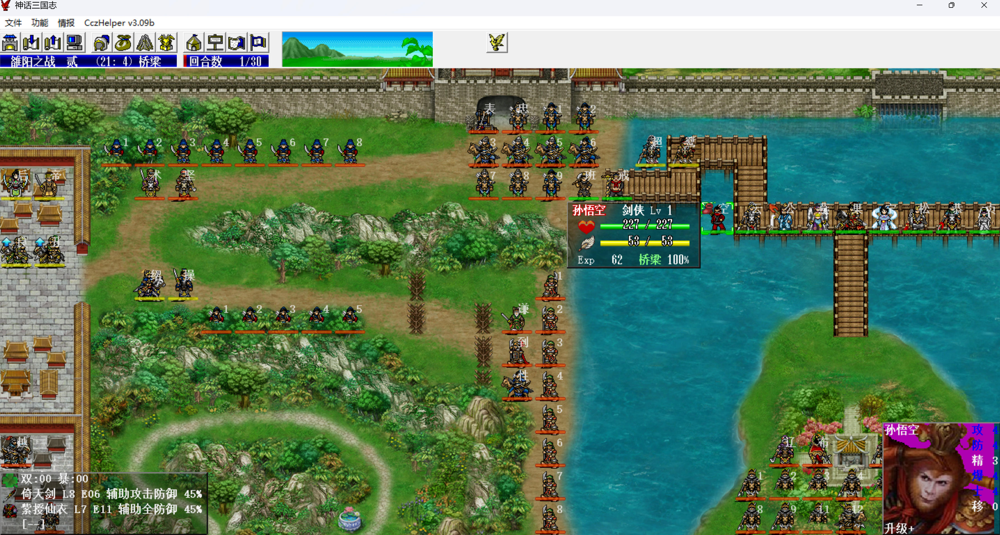
    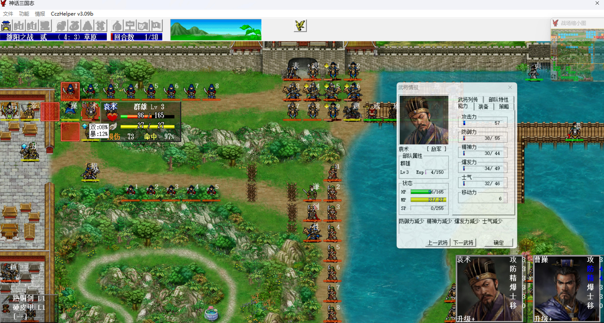

第2回合，高长恭往左走，他有和黄忠的剧情单挑。

猴哥贴身吕布卡位。吕布有同仇，不贴身的话，再来个小兵上来贴身攻击猴哥，猴哥每回合要挨吕布两下。5级吕布打1级猴哥得4点经验，2下就是8点经验了，这样撑不到29回合吕布就升级了，婴宁心控又要多得4点经验。

猴哥全防御50%+8级倚天剑辅助攻击防御45%，吕布打猴哥命中率是5%，如果打中掉血了也不要吃豆，打不死就行。残血猴哥也是可以当八戒用的。

马氏兄妹一旦击退某个弓骑，我军武将就顶上去占空位，下回合再把位置让出来给马超，这样马超可以边打边左移。不然敌军会占空位，马超一直被堵在原地。

曹操这边第三方的雷震子上来了，他既会攻击友军，也会攻击袁术部和陶谦部，谁血低他打谁，一下一个。因此暴露在雷震子一动攻击范围内的友军要注意保持血线（多用少帝卡位保护友军），促使雷震子打袁术部和陶谦部，借刀杀人。

    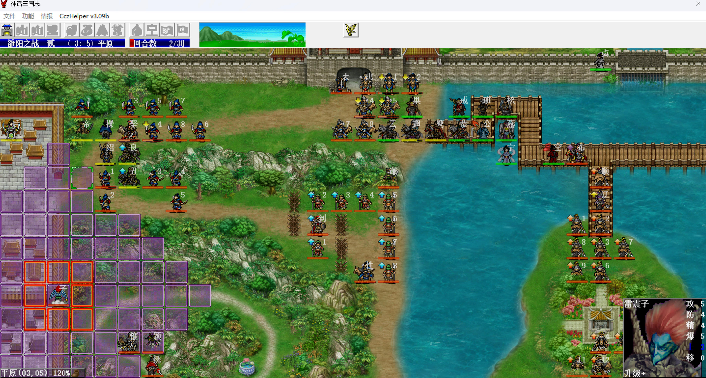
    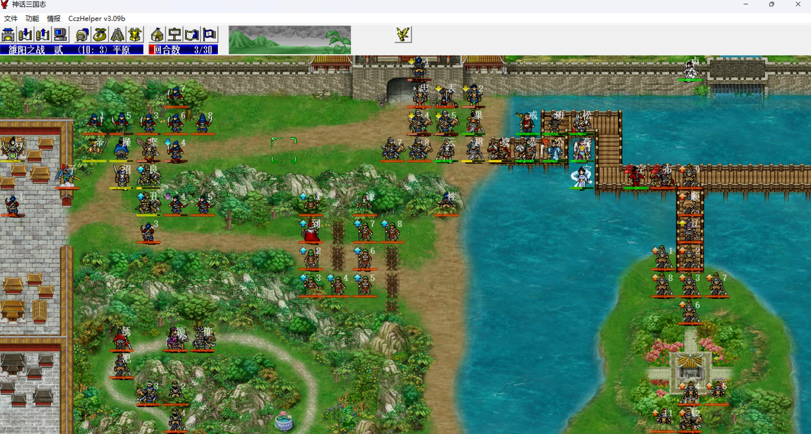

第6回合，颜良、文丑秒掉最后一个挡路的刀盾兵，曹操、袁绍右移，少帝留在原地，卡雷震子让他对着陶谦部输出。

    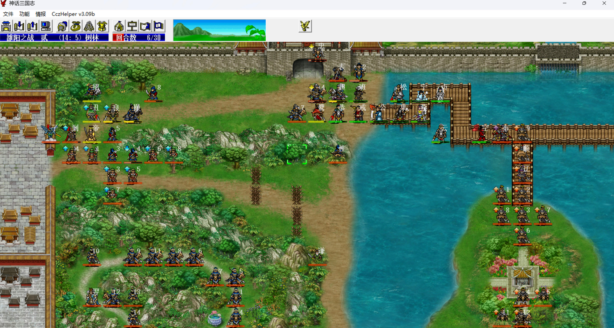
    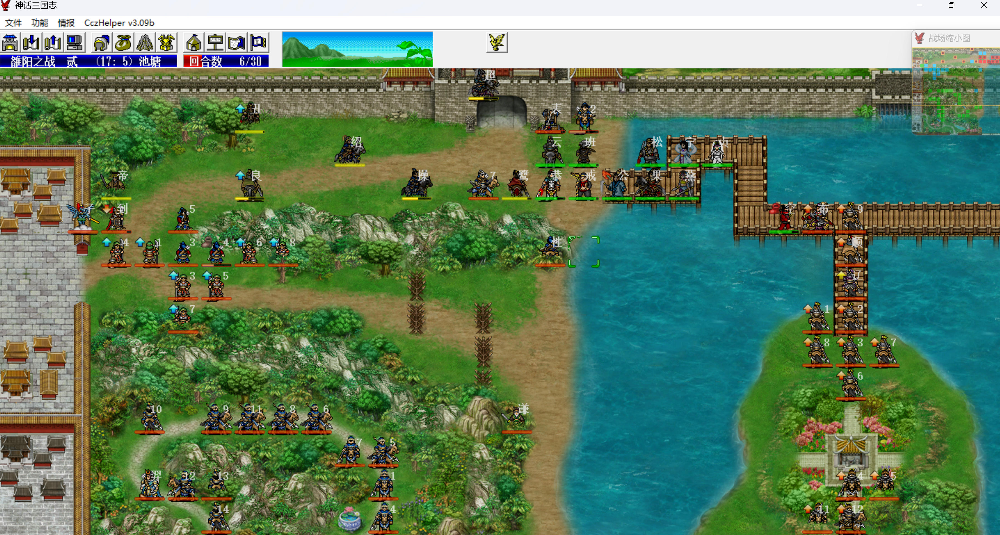

第7回合，颜良、文丑快速右移，脱离陶谦部的攻击范围，剩余陶谦部只能等着被雷震子收掉。

少帝往左上走，把剩余陶谦部、雷震子往左上拉，不要挡马超下来的路。

马超、曹操收掉攻击最后2个弓骑。练甲的人围八戒站好，八戒走位把刘表顶在角落里。桥上的人也尽快左移到中间来。

    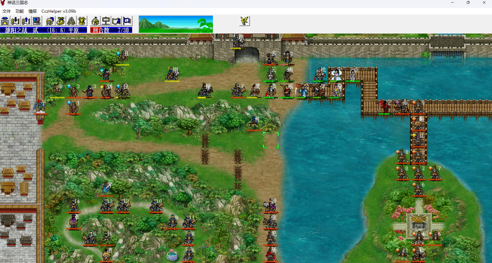
    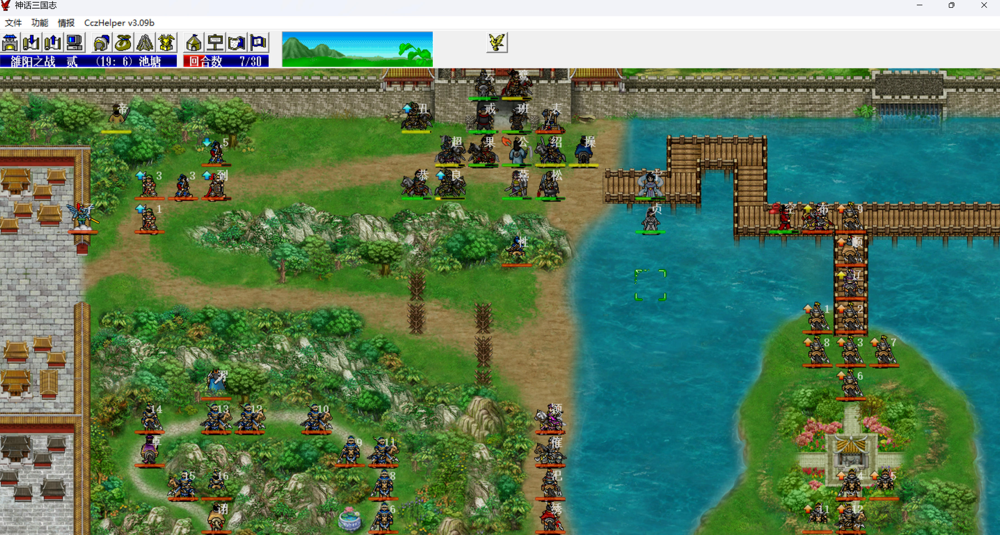

第8回合，曹操到中间平台卡位（血量不要低于吕布的斩杀线），猴哥出来把倚天剑换给飞燕。

在剩余陶谦部眼里，少帝比高长恭嘲讽；在雷震子眼里，陶谦部比高长恭嘲讽，所以高长恭直接左移，没有压力。

八戒后面负责定吕布，也适当左移，不引剩余陶谦部就行。马云禄、文丑跟着左移。

下面董卓部上来了，邹月颖冲在最前面，对飞燕用吸血。为方便后面八戒单挑，要继续让邹月颖在最前面。马超攻击曹性，曹性爆发debuff后，邹月颖对他双击率极高，双击就能秒了曹性。颜良到池塘里拖住同样冲在最前面的李傕、郭汜，这样邹月颖就遥遥领先于董卓部其他人了。

白素贞留在池塘里，兼顾支援曹操、颜良和下去拉住贾诩、李儒、后羿。

敌军阶段，飞燕把吕布拉出来。背嵬军围住曹操，sl反击多中几刀，背嵬军辅助攻击防御50%，非常恶心。邹月颖双击收掉曹性，李傕、郭汜攻击颜良。

    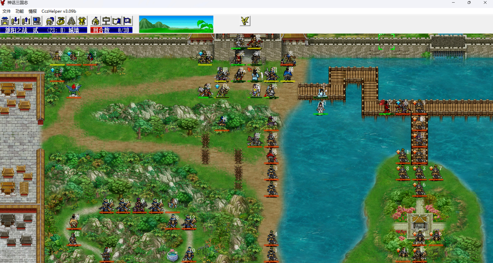
    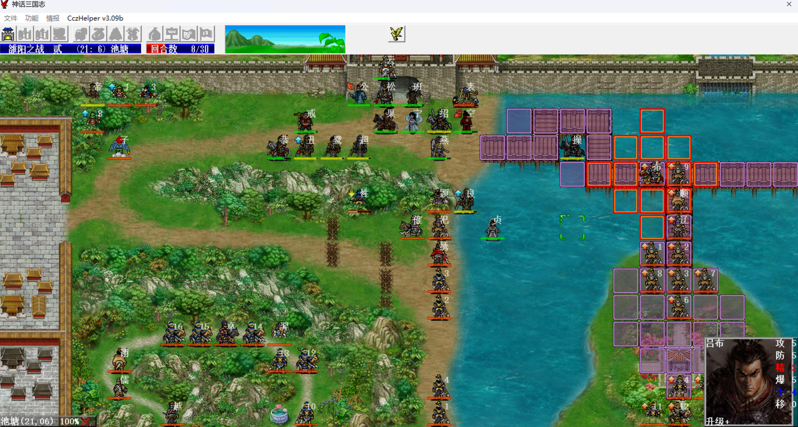

第9回合，颜良、曹操围攻收掉一个背嵬军。

飞燕把倚天剑再换给猴哥，猴哥左移把倚天剑换给八戒，挑邹月颖要用。

八戒继续把吕布往左拉，注意给吕布安排一个平原（120%）且能攻击八戒不被反击的位置。因为在吕布走位的优先级中，相较于在草原树林（110%）攻击八戒不被反击，平原攻击八戒被反击的优先级更高，若有侧后伤害加成或奋战到更多我军，则优先级更更高。

武松接替八戒练甲。

    
    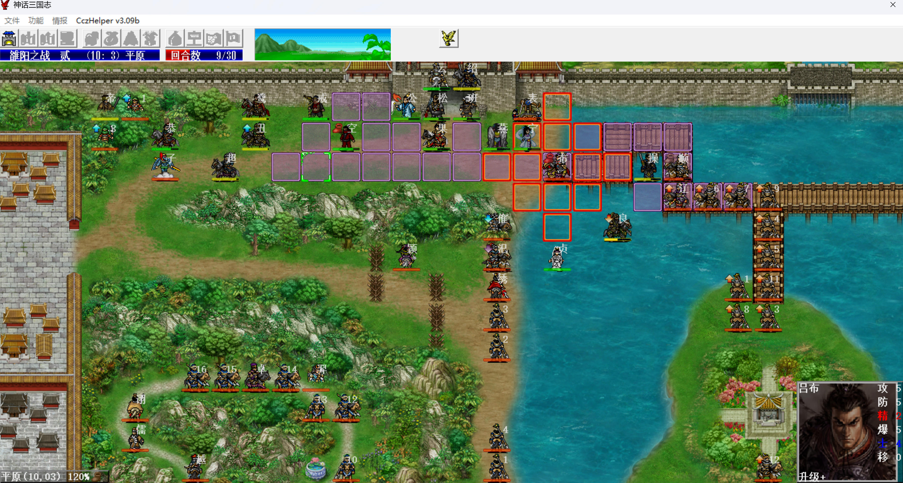

第10回合，左上只剩一个丹阳兵，敌军阶段会被雷震子秒掉，之后雷震子就只能攻击我军了，因此猴哥贴身雷震子触发单挑，下回合卡他走位。

吕布已被八戒定住，高长恭进入吕布的奋战范围，让吕布帮忙出特技。

马超下去，准备清董卓部的小兵。

曹操退到桥口，这里只会被3个背嵬军攻击到，相对于中间平台上被5个背嵬军攻击，压力小不少。之后就坚守在这个位置，耗死所有背嵬军。

    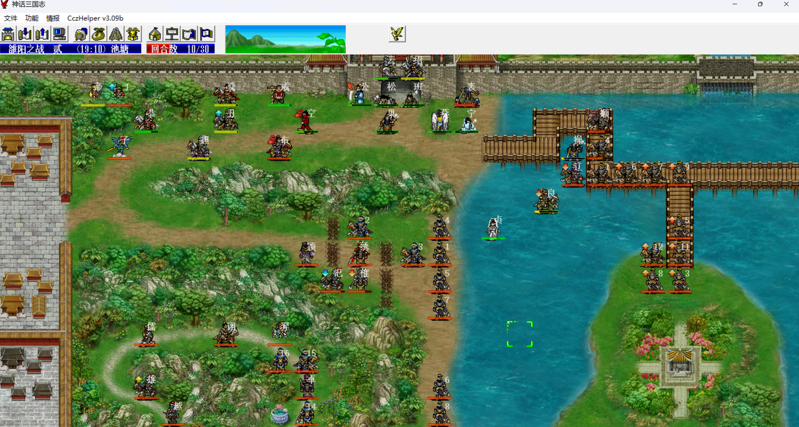
    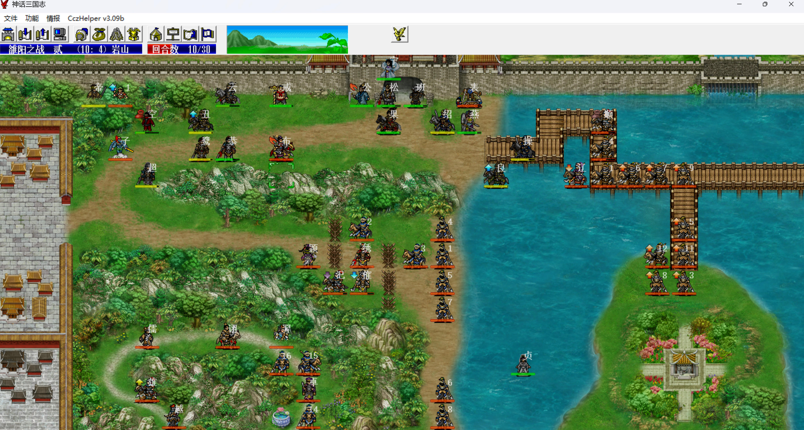

第11回合，高长恭和猴哥、少帝把雷震子卡死在树林，让他没有地形优势，将来杀起来也方便。

马超突击挡住李傕、郭汜为首的董卓军，只把邹月颖放过去，上面用低防的马云禄把邹月颖拉上来。

敌军阶段，雷震子双暴击，把猴哥打到重残。

    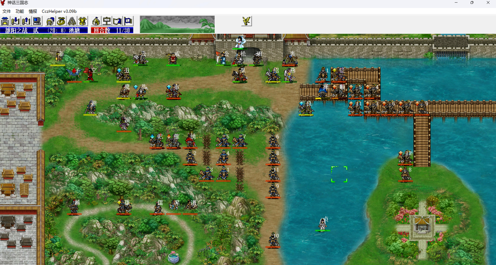
    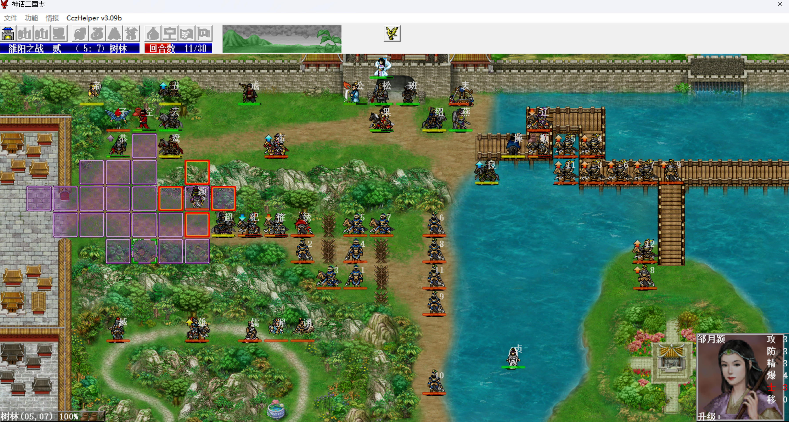

第12回合，马云禄退回来，八戒到马云禄的位置挑掉邹月颖。猴哥拿回八戒的倚天剑，雷震子打猴哥就只剩1%的命中率了。颜良没事干就找个背嵬军破下防，方便后面曹操杀。

    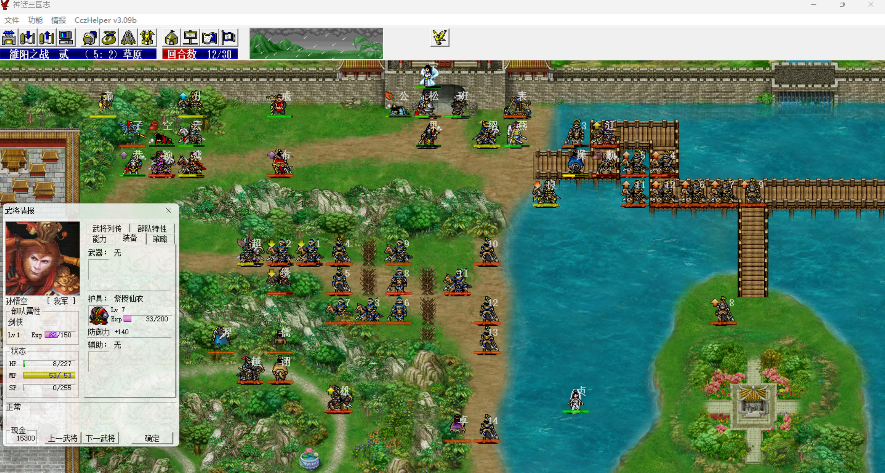
    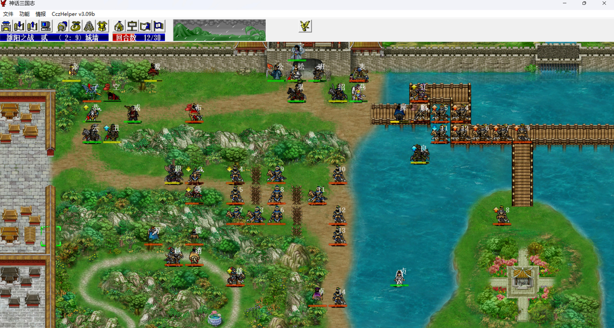

敌军阶段，贾诩、李儒用四系策略和毒招呼马超，后羿攻击马超，他们伤害比较高，所以马云禄、文丑先别急着下来。

第13回合，赵云挑掉张绣顺便给马超喂豆子，马超攻击董卓小兵吸血，八戒退回之前的位置。

    
    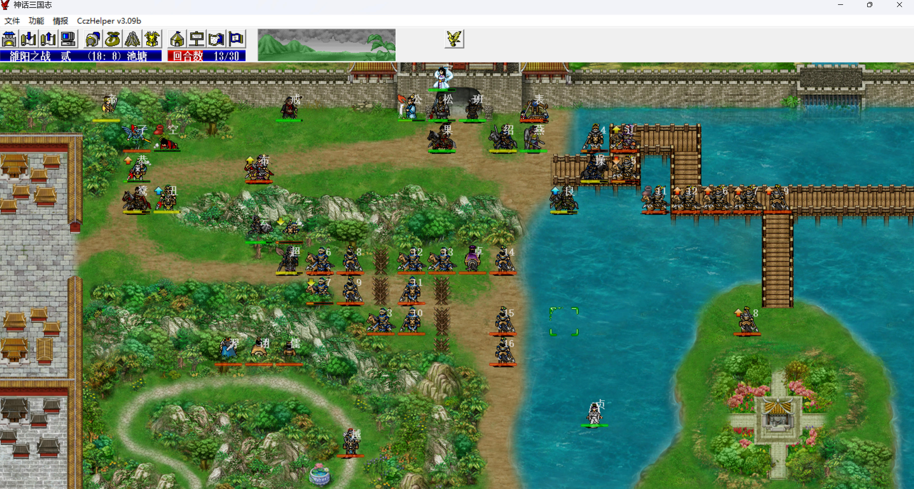

第16回合，马超击退董卓，董卓在左下出生点复活为石勒。马超不在贾诩、李儒、后羿的攻击范围内，他们继续向我军靠近。马云禄、文丑也可以下来了。

第19回合，马超、马云禄、文丑清光中间的董卓部，此前白素贞下去拉住贾诩、李儒、后羿，防止他们干扰马超清兵。

背嵬军清完后，赵云去右下的鹿寨拿道具，之后就一直在鹿寨里回血，节省豆子。

    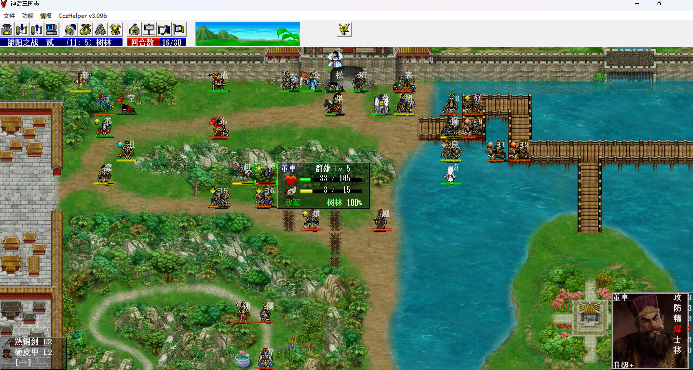
    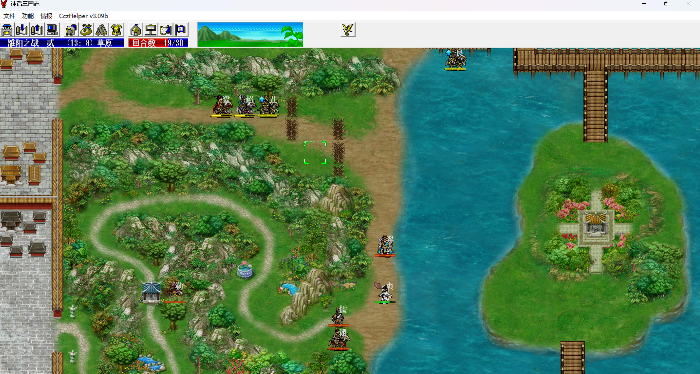

八戒通过18、19、20连续3回合的走位（下图箭头），可以吸后羿一回合攻击。

如此大费周章是因为吕布相较于不被八戒反击，更在乎侧后伤害加成和奋战更多人。

- 八戒按图中箭头走的话，是脸朝右，吕布会在八戒左边2格攻击，不产生反击。
- 八戒直接走到这儿的话，是脸朝下，吕布会去八戒右上角的平原攻击（右上是背后攻击，原地是侧面攻击，伤害加成不同），产生反击，还能奋战到徐茂公。

只能吸后羿1回合也是因为，吕布攻击完八戒，八戒是脸朝左的，如果八戒不动，吕布下回合还是会到八戒右上角。

颜良攻击后羿、贾诩，sl破他们的防。之后马超、文丑围攻后羿，颜良、马云禄打贾诩、李儒，慢慢耗。

石勒有25mp，能放4次风/小补给。白素贞去引石勒吹风，提前耗光他的mp，将来残血也没法用小补给。

    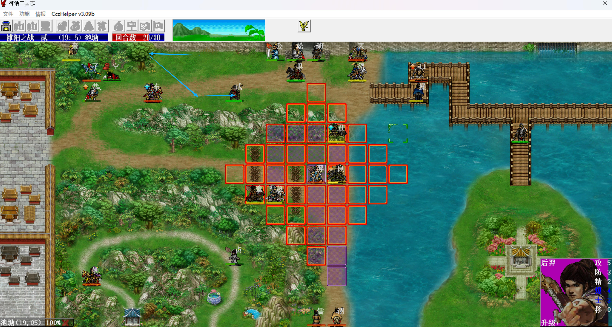
    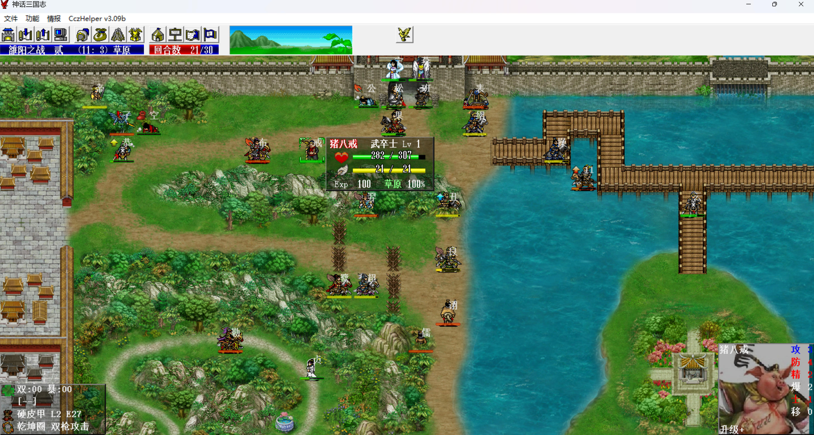
    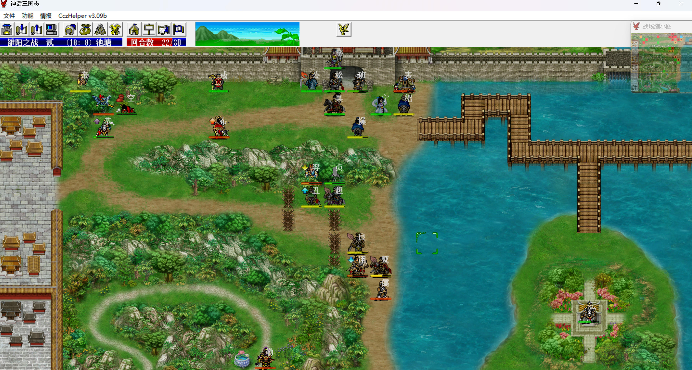

第29回合，残血猴哥把石勒、雷震子拉到了一起。婴宁心控吕布，颜良破防石勒（无反击），少帝、八戒卡位，防止雷震子去打颜良。

    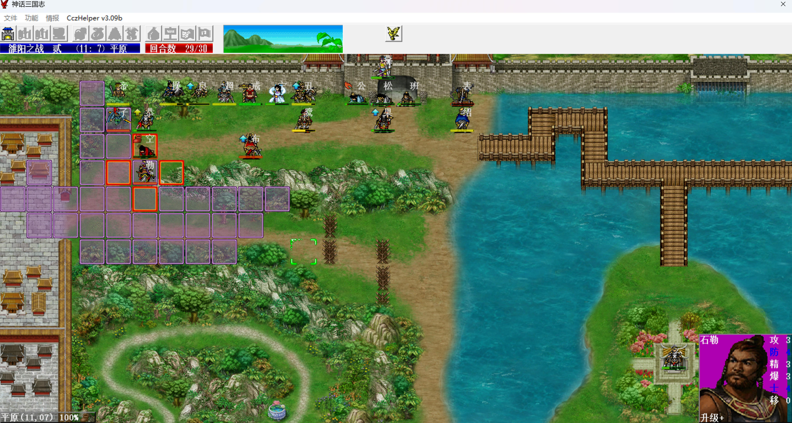
    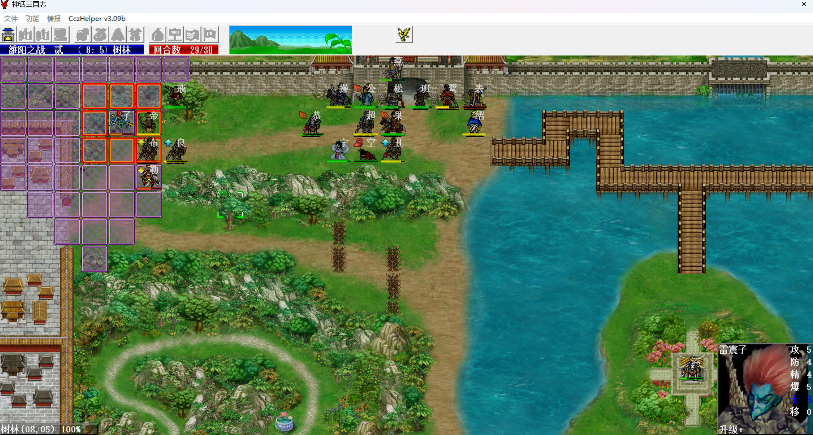

敌军阶段，石勒攻击吕布，吕布先手打残石勒，然后被石勒反击混乱，雷震子给石勒小补给。

第30回合，颜良破防雷震子被秒，少帝用醒脑丸解吕布混乱，吕布奋战收掉雷震子、石勒，袁绍击退刘表过关。

    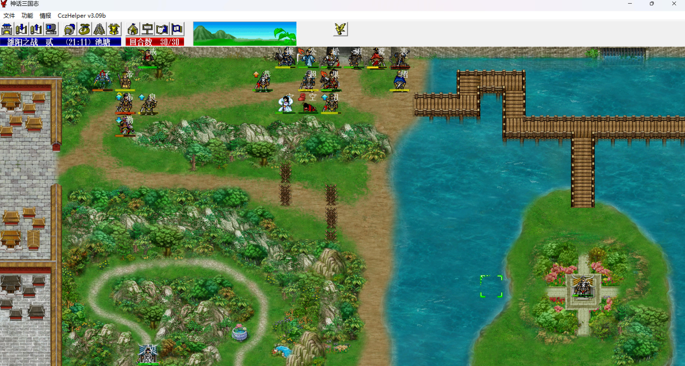
    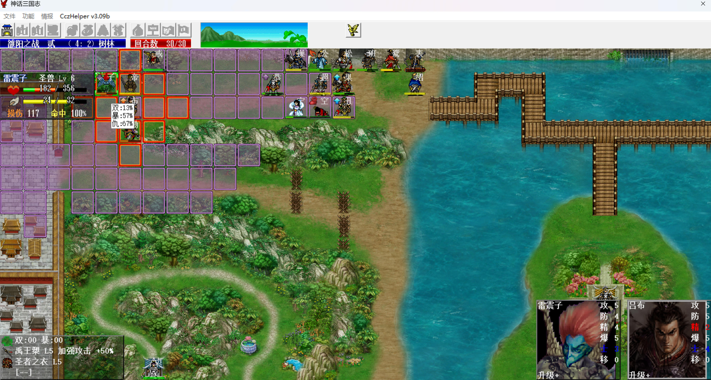

本关：

- 1级婴宁心控5级吕布得10+4\*4=26点经验，1.60 => 1.86。
- 1级八戒手动单挑5级邹月颖得38+2\*4=46点经验，1.54 => 1.100。
- 倚天剑：8.6 => 8.30，八戒手动单挑时是4倍经验状态，3\*2\*4=24。
- 破甲刀：5.74 => 6.177，30回合经验书，婴宁1次心控。
- 丈八：4.61 => 6.111，30回合经验书，30回合鲁大师。
