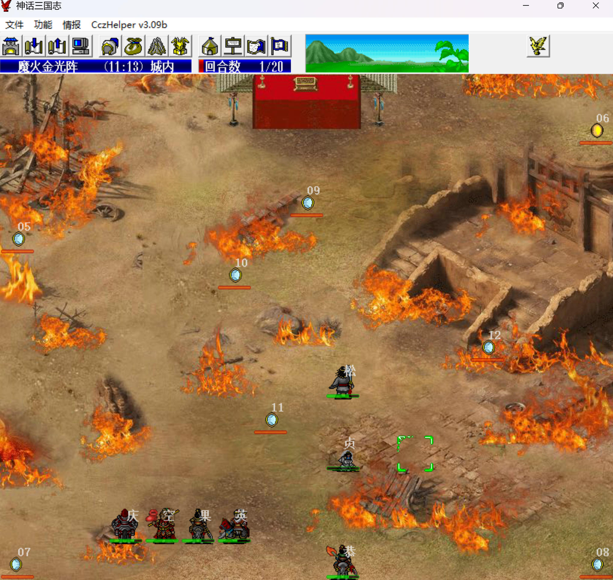
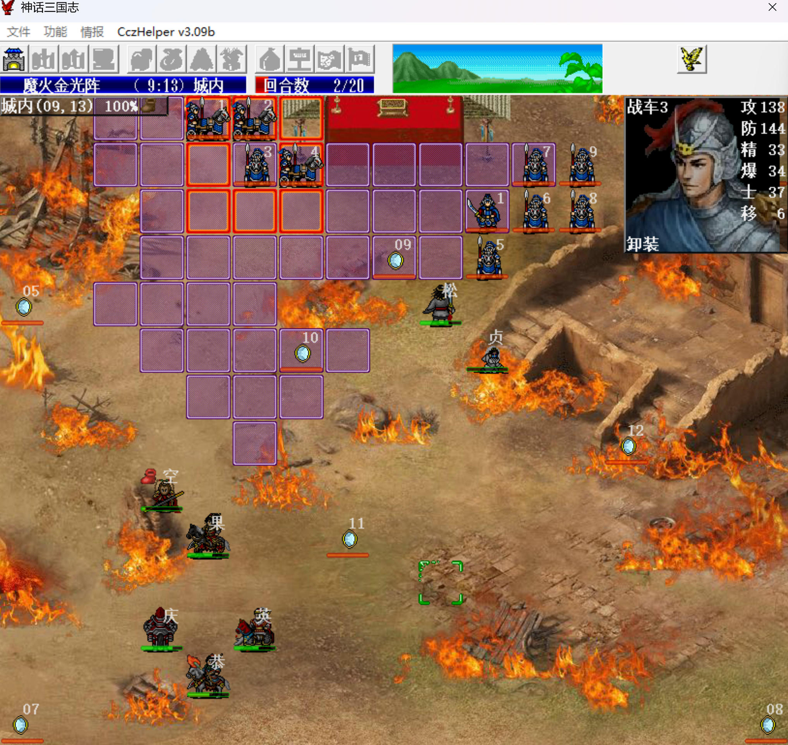
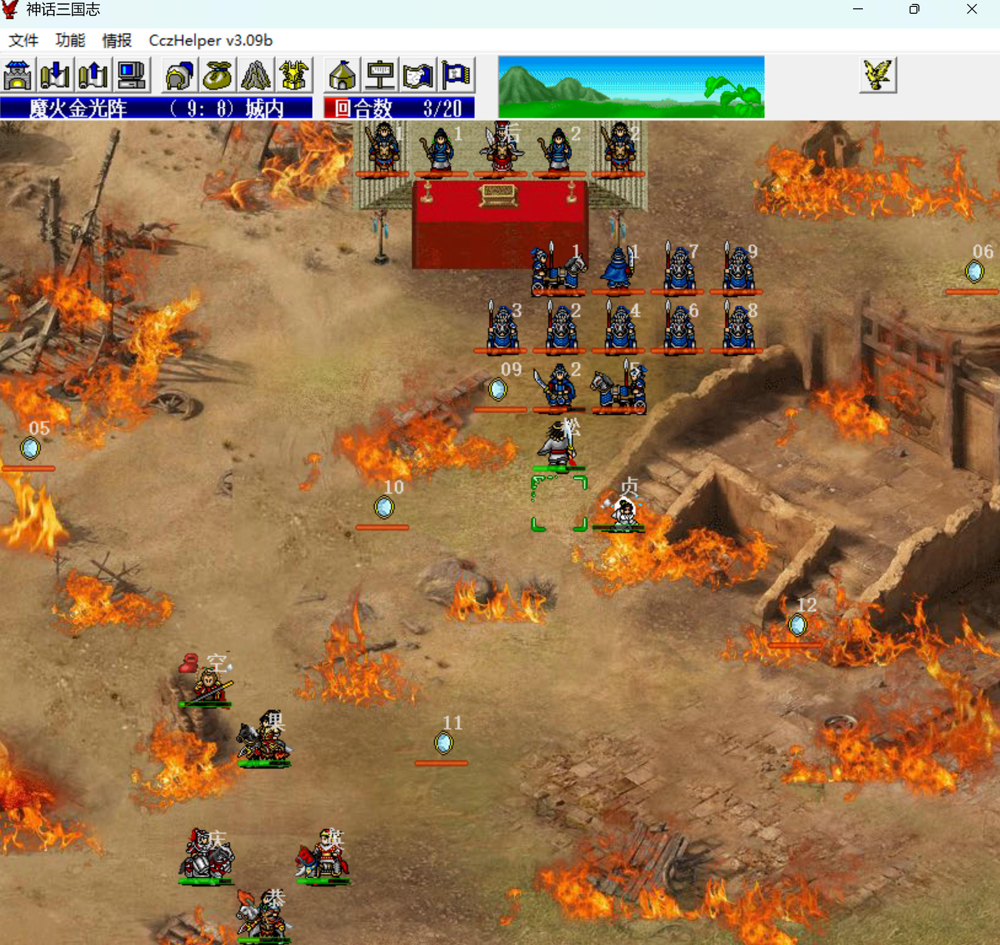
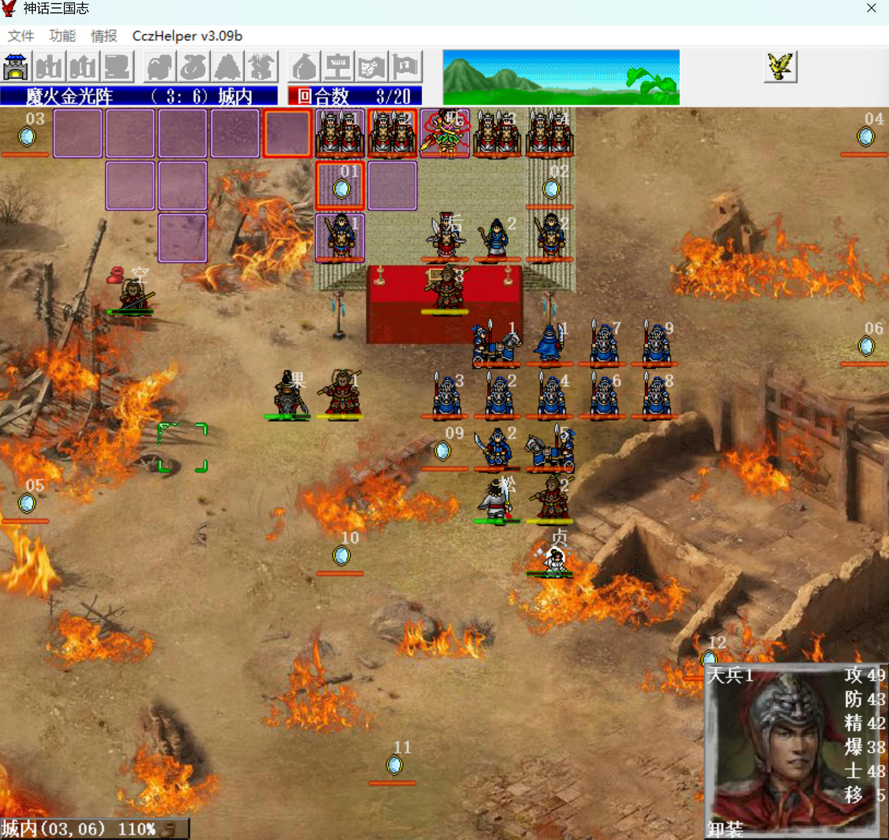
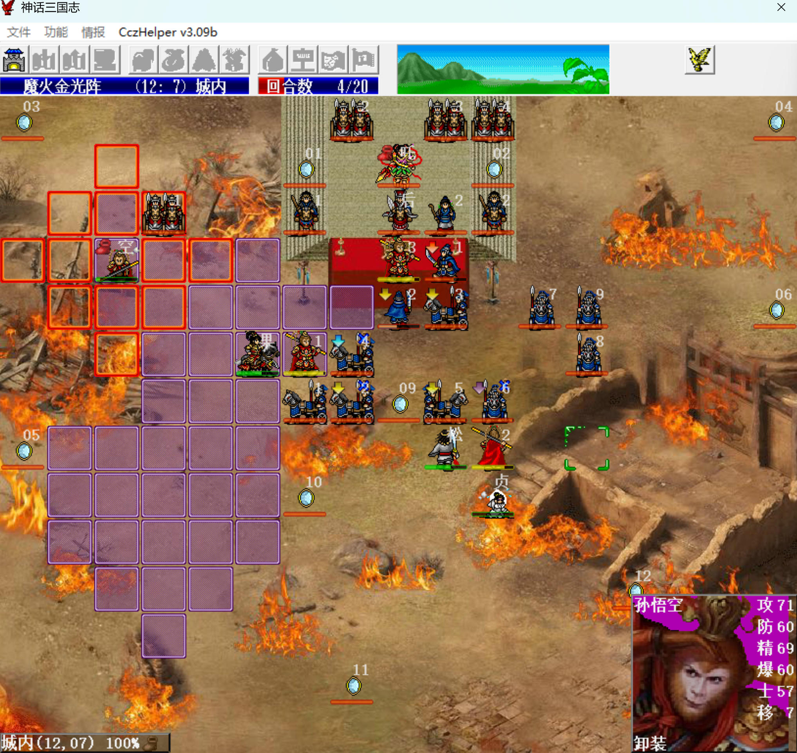
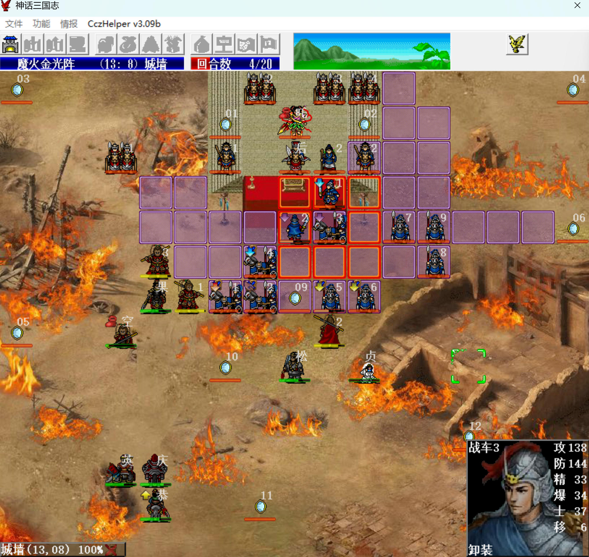
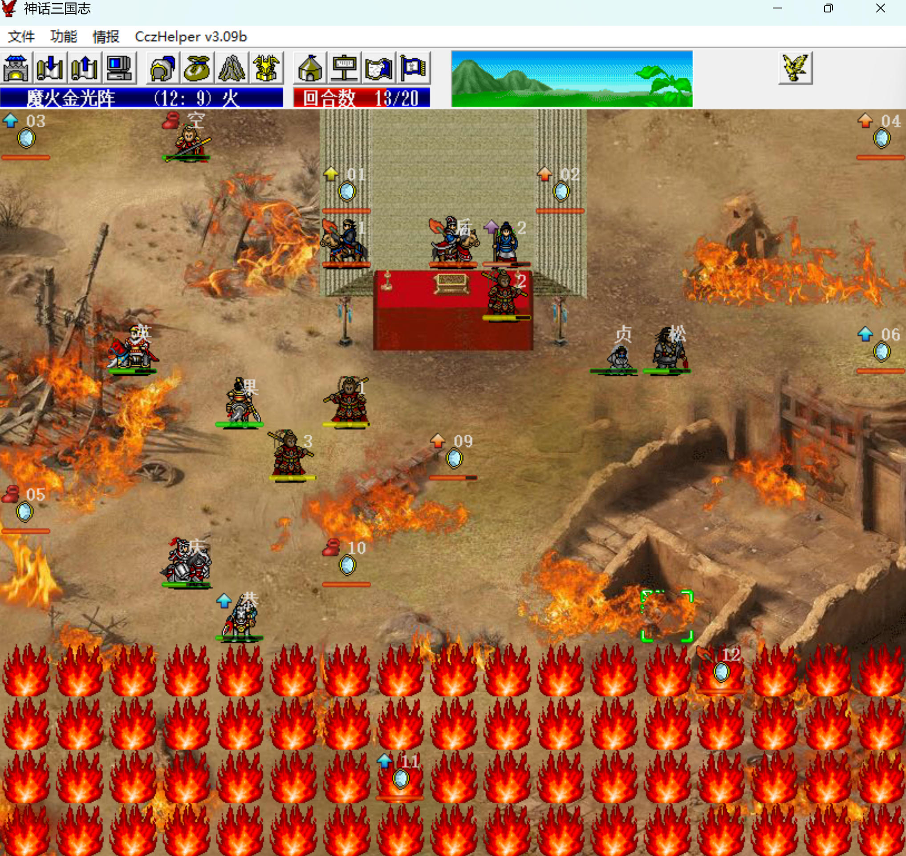
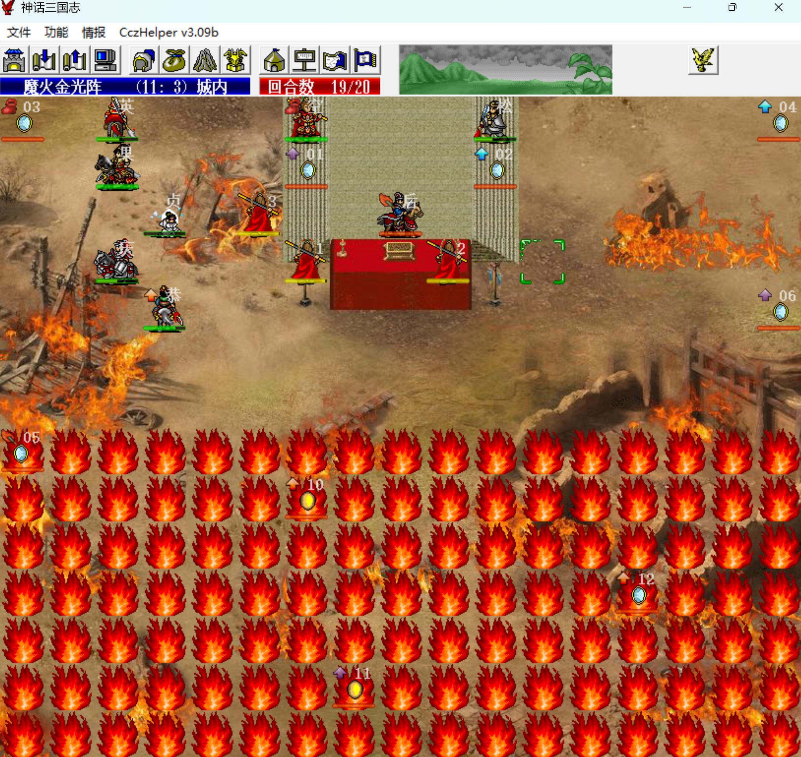

R15 收裴元庆，观音处买10级倚天。

S15 魔火金光阵

本关保守估计需15个手榴弹，不足备齐。

猴哥变战魔，唯一的自选武将出高长恭，刷特技加属性。

开场：

- 主角：鬼神枪、1级硬皮甲、+2马，替猴毛吸引火力，以及单挑方便被穆桂英秒。
- 猴哥：白羽扇、经验书，下关薄命司之战要用。
- 白素贞：9级金箍棒，给猴哥带的，单挑用。
- 穆桂英：方天、经验书。
- 武松：双股剑、乾坤圈。
- 裴元庆：10级倚天、1级鹤氅，阴阳镜敌军阶段全屏攻击，为保住猴毛，裴元庆低防吸引火力。
- 高长恭：1级硬皮甲，同吸引阴阳镜火力。

第1回合，穆桂英给白素贞喂豆子，白素贞踩雷，武松向上走到头，把敌军往右拉，方便猴哥上去招猴毛。

左边先别急着上去，猴哥自己吃豆子回满血，其他人喂高长恭吃果到500，下关高长恭必升级。

敌军阶段，9辆指南车攻防+100，奔着右边去了。

第2回合，猴哥踩雷，主角到猴哥右下角，恰好不会把指南车引过来。

    
    

敌军阶段，大都督拉指南车围攻武松，武松双枪反击，之后武松就不会再出手了，去左边后把乾坤圈换给主角。

第3回合，猴哥到（2，3）招出猴毛，这儿天兵正好够不着，哪吒会去打猴毛，也不会来招惹猴哥。

右上猴毛腾云到武松旁边；中间的猴毛围攻击退风后左边的医生（利用围攻的伤害加成）；里面的猴毛腾云出来踩雷，主角给猴毛喂麦子（需要+2马，不然够不着）。

    
    

敌军阶段，猴毛比武松嘲讽，所以右路的指南车围攻猴毛。中间两个猴毛把敌军堵在右边。

第4回合，右边猴毛卡位顶住，白素贞喂豆；左边两个猴毛卡位顶住，主角、猴哥喂豆。之后长期保持这个阵型与敌军耗。

指南车攻防+100后，再结合冲锋攻击，对猴毛威胁很大，但好在指南车只有64敏，命中率不高。猴毛打指南车伤害只有1，必须破了防才能打得动，但双击率挺高。

第4、8、16回合敌军阶段，风后会让敌军全体提升全能力。

提升全能力后的指南车，猴毛必须破两次防后才能打得动，如果不想sl破防或者急于清掉指南车，可采用手榴弹。

裴元庆单挑哪吒是会得经验的，所以要注意哪吒的经验，在他升级前把他挑掉。不要留空位让他能同时奋战多个我军，这样得经验贼快。

    
    

第3、5、7、11、15、19回合敌军阶段，地图最下方会起火。起火似乎会影响阴阳镜的仇恨（不确定是不是伯伯补丁的问题），导致阴阳镜攻击最下面的武将，即便八戒在场也是如此。因此可将高长恭放最下面，他有远程减伤90%，阴阳镜打他都是个位数，很好控制出特技。

猴哥第19回合单挑风后需要先击退一个阴阳镜，猴毛打阴阳镜只能靠扔手榴弹，258HP，扔5个就行了。

击退所有指南车、天兵、大都督后，敌军就只剩原地站桩的了，风后两边的文官打不打都无所谓。

武松有策略减伤60%，可以让风后帮忙练甲。

第19回合，主角把鬼神枪、乾坤圈换给穆桂英。裴元庆拿10级倚天换猴哥的白羽扇，白素贞再把金箍棒换给猴哥（白素贞拿不了扇子，没法直接换）。

猴哥单挑风后，第1回合吃武力果，风后9级白羽扇打猴哥200左右，鬼神加成45%，第2回合直接暴击秒满血风后。

    
    

本关：

- 1级猴哥手动单挑11级风后得38+2\*10=58点经验，1.112 => 2.20，以战魔的属性成长升级。
- 1级裴元庆剧情单挑1级哪吒得32点经验，1.0 => 1.32。
- 1级武松反击1级大都督得6点经验，1.90 => 1.96。
- 白羽扇：3.0 => 3.190。
- 方天：4.140 => 5.130。
- 双股剑：2.6 => 2.12，武松拿双枪反击一次。