R16 1级风后加入。主角、穆桂英手动单挑，主角吃豆，1级穆桂英双击秒掉2级主角得40点经验，1.0 => 1.40。

S16 薄命司之战

本关保守估计需3个手雷、14个手榴弹，不足备齐。

本关只有1个自选武将，依然出高长恭，刷特技加属性。

风后本关挑6级警幻仙子得32+8\*5=72点经验，下次单挑要到肥水，且秦皇陵要升到11级，所以本关可适当得些经验，不升级即可。

本关友军依然是3个猴毛，打第二阵时猴哥可以召唤，所以难点在第一阵，只有高长恭、风后俩人能出手。第一阵共10个敌军：

- 6级绛珠仙子（9级倚天、紫绶，196HP）。
- 8个红颜军（2个5级250HP、6个6级256HP，9级黄金甲），出场回合的敌军阶段攻防+100。
- 1级甄宓（9级倚天、紫绶），坚守原地。

复数攻击打包收人头的方式：

- 高长恭带丈八，一次可以打三个，但既打不中绛珠仙子和甄宓（攻击防御90%），也打不动红颜军（9级黄金甲再加100防）。
- 风后带玄女兵书，火龙一次可以打九个。

因此只能是高长恭带破甲刀，对绛珠仙子、红颜军打上两刀（共出手17次，黄金甲不吃双击），并把他们排成九宫，风后一个火龙全部带走。但是，绛珠仙子、红颜军都会吸血！

|     敌军      |        MP        |   HP    | 破甲两刀后HP | 吸血伤害 | 风后火龙极限伤害 | 允许吸血成功次数 |
| :-----------: | :--------------: | :-----: | :----------: | :------: | :--------------: | :--------------: |
|  6级绛珠仙子  |  26，可吸3次血   |   196   |      40      |    25    |        81        |       1次        |
| 5级/6级红颜军 | 20/22，可吸2次血 | 250/256 |    50/52     |  36/38   |        96        |       1次        |

如果绛珠仙子、红颜军吸血成功次数超过1次，高长恭就要出手更多次，得更多的经验。

开场：

- 主角：方天、要练的防具、玄女兵书。
- 猴哥：9级金箍棒、无缝、太极图，单挑用。
- 高长恭：戒刀、9级黄金甲、乾坤圈。
- 风后：白羽扇、鹤氅、经验书。

把敌军拉成九宫需要利用一个特性，敌军在自己可移动范围内搜索不到可攻击的我军时，会原地不动。所以除高长恭外，另外三人都利用太极图翻墙下去。

前3回合，主角、猴哥不断交换太极图，先把猴哥送下去。风后到墙边缘，等着引出红颜军后就下去。主角拿太极图在上面，猴哥拿玄女兵书在下面。

第4回合，高长恭到（7，5）引出红颜军和甄宓。主角、风后交换太极图，把风后送下去，太极图最后留在主角身上。注意主角的走位，既能保证被打不出反击，还能给高长恭喂豆子。同时与风后、猴哥站成一条线，利用炮车练防具。

    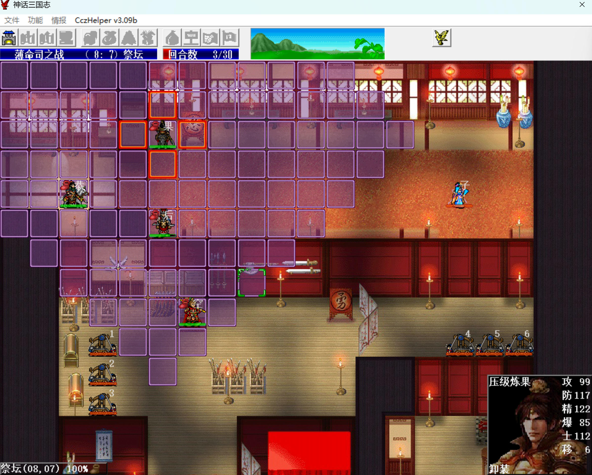
    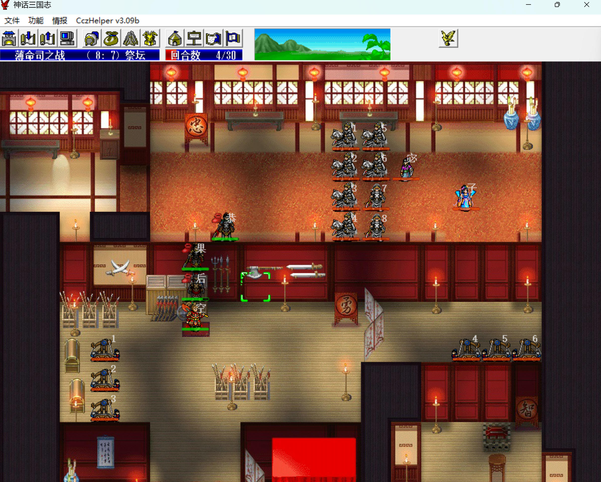

敌军阶段，绛珠仙子和4个红颜军来打高长恭，被破甲反击。绛珠仙子、红颜军在满血或普攻能打出高伤害时，是不会吸血的。

|    敌军    | 绛珠仙子 | 1号红颜军 | 2号红颜军 | 3号红颜军 | 4号红颜军 | 5号红颜军 | 6号红颜军 | 7号红颜军 | 8号红颜军 |
| :--------: | :------: | :-------: | :-------: | :-------: | :-------: | :-------: | :-------: | :-------: | :-------: |
| 被破甲次数 |    2     |     1     |     1     |     1     |     1     |     0     |     0     |     0     |     0     |
| 可吸血次数 |    3     |     2     |     2     |     2     |     2     |     2     |     2     |     2     |     2     |

第5回合，主角把太极图换给高长恭（已双枪反击过绛珠仙子，暂时不再需要双枪了）。

要想一个火龙恰好收掉绛珠仙子和8个红颜军，必须保持红颜军同步掉血蓝，不能有的已经喘气没蓝了，有的还满血满蓝。

高长恭出特技，右移给自己吃豆，把剩下来的3个红颜军也引过来，利用反击下她们血。

另外三人没啥生存压力，掉血了不要急于吃豆。

    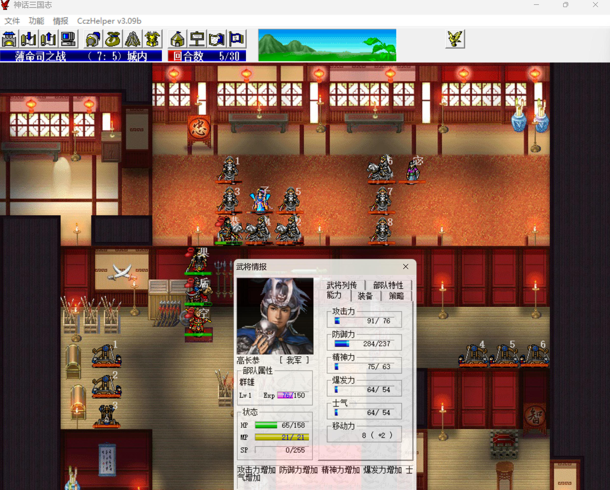
    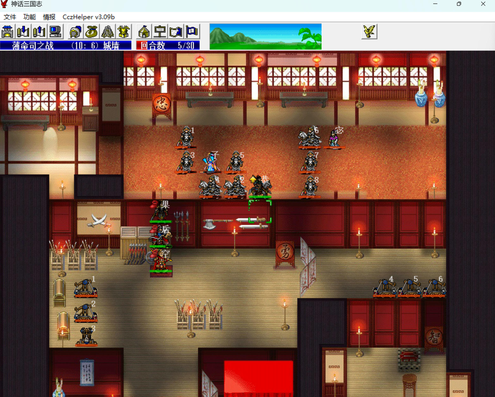

敌军阶段，绛珠仙子和1个红颜军吸血成功，另外3个红颜军吸血失败。

第6回合，高长恭再左移吃豆。

    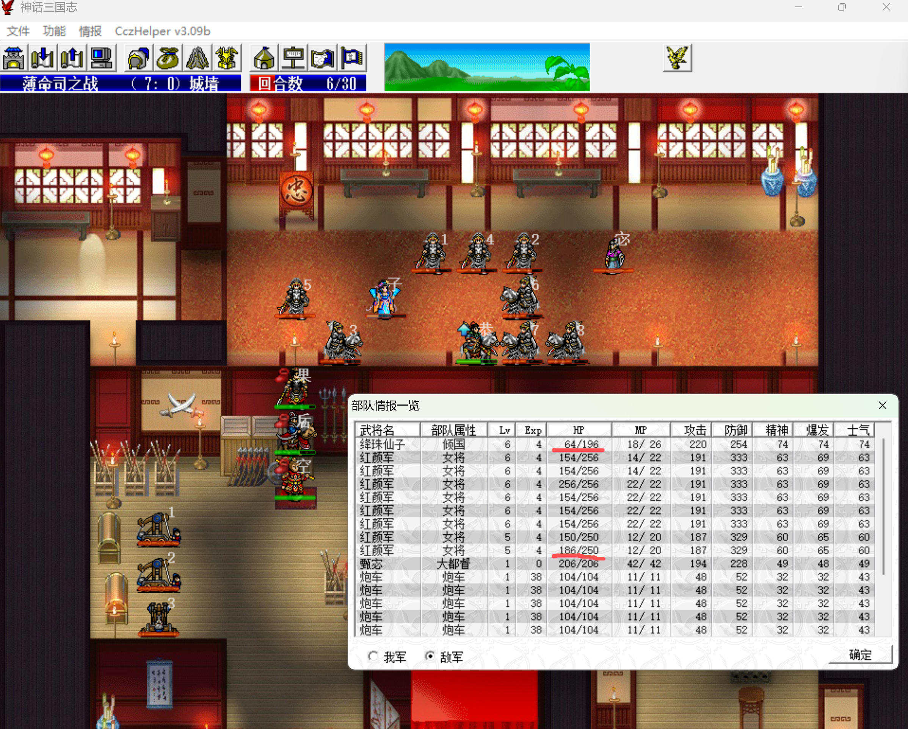
    

敌军阶段，绛珠仙子和红颜军继续对着高长恭输出，sl注意三点：

1. 绛珠仙子和上回合吸血成功的红颜军不能再吸血成功。
2. 上回合吸血失败的红颜军这回合无所谓成不成功了，但别把高长恭吸死了。
3. 之前没吸过血的尽量不要吸血成功。

第7回合，高长恭左移攻击主角上面2格满血满蓝的红颜军，主角给高长恭吃豆。

此时8号红颜军被破甲两刀，但她满蓝，还可以放吸血，其它7个红颜军都被破甲一刀。

    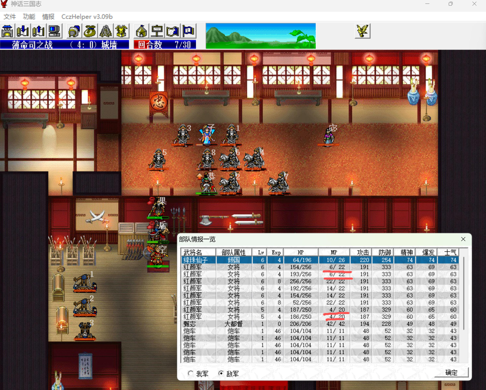
    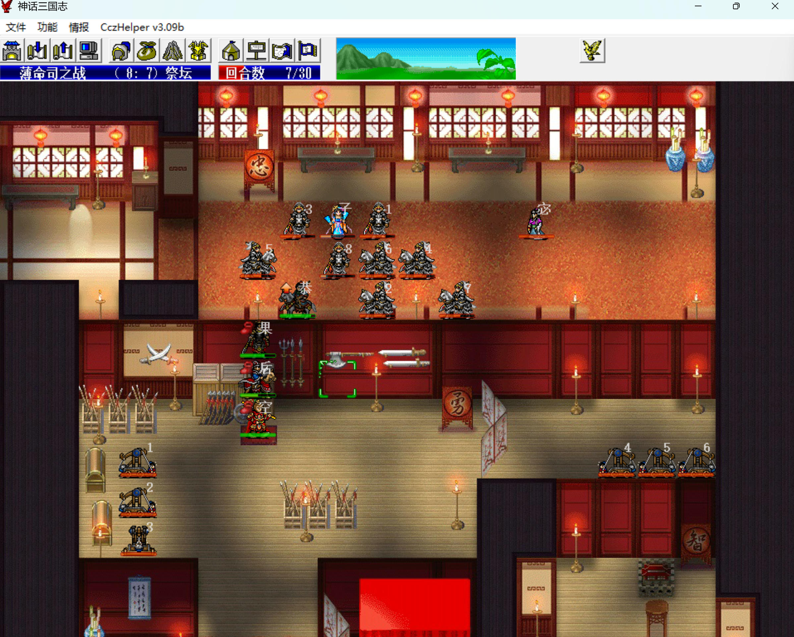

敌军阶段，绛珠仙子来打不会反击的主角。

4个已经放不出吸血的红颜军被破甲反击，进入待火龙秒的状态。8号红颜军吸血失败，也进入待火龙秒的状态（还能再放一次吸血）。

第8回合，5、6、7号红颜军没进入待火龙秒状态（5号还能放2次吸血）。绛珠仙子和5号红颜军没在九宫位置中。

高长恭穿越下来，把太极图给风后，风后右移一格把绛珠仙子拉过来，同时把太极图给主角，主角也穿越下来。

    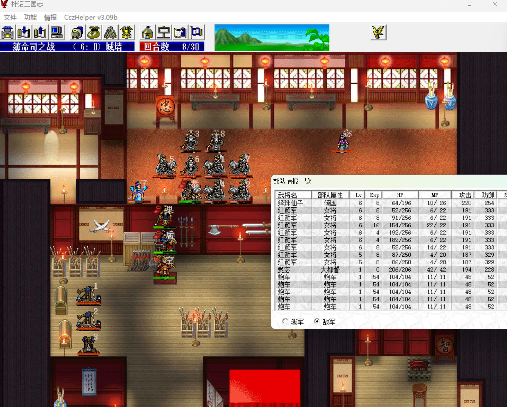
    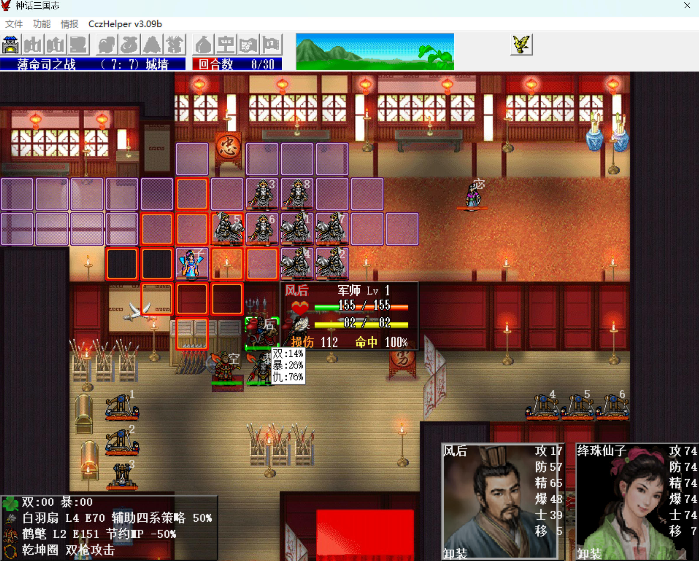

敌军阶段，绛珠仙子来打风后。

第9回合，主角、风后、高长恭交换太极图调整位置。

风后进入放火龙的位置，之后就不动了。

高长恭去赚7号红颜军的反击，同时把5号红颜军拉到最后一个九宫位置放吸血（有时候会去7号红颜军右边，sl下）。

主角去帮高长恭扛刀子，否则2号红颜军打高长恭就被反击死了。

    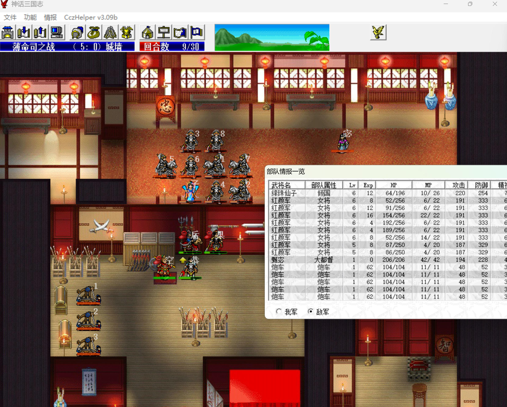
    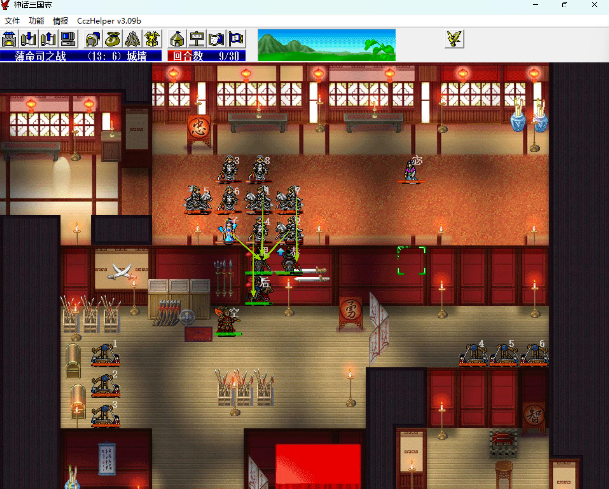

敌军阶段，

本关：

- 高长恭击退第一阵的全部敌军升到5级104
- 2级猴哥单挑6级元始得46点经验
- 1级风后三水秒6级警幻得72点经验
