R16 1级风后加入。主角、穆桂英手动单挑，主角吃豆，1级穆桂英双击秒掉2级主角得40点经验，1.0 => 1.40。

S16 薄命司之战

本关需23个手榴弹，不足备齐。唯一的自选武将依然出高长恭，刷特技加属性。

风后本关挑6级警幻得32+8\*5=72点经验，下次单挑要到肥水，且秦皇陵要升到11级，所以本关可适当得些经验，不升级即可。

本关友军依然是3个猴毛，打第二阵时猴哥可以召唤，所以难点在第一阵，只有高长恭、风后俩人能出手。第一阵共10个敌军：

- 6级绛珠（9级倚天、紫绶，196HP）。
- 8个红颜军（2个5级250HP、6个6级256HP，9级黄金甲），出场回合的敌军阶段攻防+100。
- 1级甄宓（9级倚天、紫绶），坚守原地。

打包收人头的方式：

- 高长恭带丈八，一次可以打三个，但既打不中绛珠和甄宓（攻击防御90%），也打不动红颜军（9级黄金甲再加100防）。
- 风后带玄女兵书，火龙一次可以打九个。

因此只能是高长恭带破甲刀，对绛珠、红颜军打上两刀（共出手17次，黄金甲不吃双击），并把他们排成九宫，风后一个火龙全部带走。但是，绛珠、红颜军都会吸血！

|     敌军      |        MP        |   HP    | 破甲两刀后HP | 吸血伤害 | 风后火龙极限伤害 | 允许吸血成功次数 |
| :-----------: | :--------------: | :-----: | :----------: | :------: | :--------------: | :--------------: |
|    6级绛珠    |  26，可吸3次血   |   196   |      40      |    20    |        81        |       2次        |
| 5级/6级红颜军 | 20/22，可吸2次血 | 250/256 |    50/52     |  36/38   |        96        |       1次        |

允许的吸血成功次数，否则高长恭就要出手更多次，得更多的经验：

- 绛珠吸血成功次数<=2次，且2次加起来伤害<=45。
- 红颜军吸血成功次数<=1次。

开场：

- 主角：方天、要练的防具、玄女兵书。
- 猴哥：9级金箍棒、无缝、太极图，单挑用。
- 高长恭：戒刀、9级黄金甲、乾坤圈。
- 风后：白羽扇、鹤氅、经验书。

把敌军拉成九宫需要利用一个特性，敌军在自己可移动范围内搜索不到可攻击的我军时，会原地不动。所以除高长恭外，另外三人都利用太极图翻墙下去。

前3回合，主角、猴哥不断交换太极图，先把猴哥送下去。风后到墙边缘，等着引出红颜军后就下去。主角拿太极图在上面，猴哥拿玄女兵书在下面。

第4回合，高长恭到（7，5）引出红颜军和甄宓。主角、风后交换太极图，把风后送下去，太极图最后留在主角身上。注意主角的走位，既能保证被打不出反击，还能给高长恭喂豆子。同时与风后、猴哥站成一条线，利用炮车练防具。

    
    

敌军阶段，绛珠和1、2、3、4号红颜军普攻高长恭，被破甲反击。绛珠、红颜军在满血或普攻能打出高伤害时，是不会吸血的。

|     敌军     | 绛珠 | 1号 | 2号 | 3号 | 4号 | 5号 | 6号 | 7号 | 8号 |
| :----------: | :--: | :-: | :-: | :-: | :-: | :-: | :-: | :-: | :-: |
|  被破甲次数  |  2   |  1  |  1  |  1  |  1  |  0  |  0  |  0  |  0  |
|  可吸血次数  |  3   |  2  |  2  |  2  |  2  |  2  |  2  |  2  |  2  |
| 吸血成功次数 |  0   |  0  |  0  |  0  |  0  |  0  |  0  |  0  |  0  |

第5回合，主角把太极图换给高长恭，保持绝对自由的移动，而且已双枪反击过绛珠，暂时不再需要双枪了。

要想1个火龙恰好收掉绛珠和8个红颜军，必须保持红颜军同步掉血蓝，不能有的已经喘气没蓝了，有的还满血满蓝。

高长恭被打残出特技，右移给自己吃豆，把6、7、8号红颜军也拉过来，赚破甲反击。

另外3人没啥生存压力，掉血了不要急于吃豆。

    
    

敌军阶段，绛珠和2号红颜军吸血成功，1、3、4号红颜军吸血失败。

6、7、8号红颜军普攻高长恭，被破甲反击。5号红颜军去打主角。

|     敌军     | 绛珠 | 1号 | 2号 | 3号 | 4号 | 5号 | 6号 | 7号 | 8号 |
| :----------: | :--: | :-: | :-: | :-: | :-: | :-: | :-: | :-: | :-: |
|  被破甲次数  |  2   |  1  |  1  |  1  |  1  |  0  |  1  |  1  |  1  |
|  可吸血次数  |  2   |  1  |  1  |  1  |  1  |  2  |  2  |  2  |  2  |
| 吸血成功次数 |  1   |  0  |  1  |  0  |  0  |  0  |  0  |  0  |  0  |

第6回合，高长恭再左移吃豆。

    
    

敌军阶段，绛珠和除5、8号外的红颜军都对高长恭吸血，注意：

- 绛珠和上回合吸血成功的2号红颜军不能再吸血成功。
- 上回合吸血失败的1、3、4号红颜军这回合成不成功无所谓，只要别把高长恭吸死就行。
- 之前没吸过血5、6、7、8号红颜军尽量不要吸血成功。

实际5号红颜军继续打主角，1、4、6号红颜军吸血成功，其他失败，8号红颜军最后一个行动时发现吸不死高长恭，改普攻了。

|     敌军     | 绛珠 | 1号 | 2号 | 3号 | 4号 | 5号 | 6号 | 7号 | 8号 |
| :----------: | :--: | :-: | :-: | :-: | :-: | :-: | :-: | :-: | :-: |
|  被破甲次数  |  2   |  1  |  1  |  1  |  1  |  0  |  1  |  1  |  2  |
|  可吸血次数  |  1   |  0  |  0  |  0  |  0  |  2  |  1  |  1  |  2  |
| 吸血成功次数 |  1   |  1  |  1  |  0  |  1  |  0  |  1  |  0  |  0  |

第7回合，高长恭左移攻击满血满蓝的5号红颜军，主角给高长恭吃豆。

    
    

敌军阶段，绛珠来打不会反击的主角。

1\~4号红颜军已放不出吸血，普攻高长恭，被破甲反击，5号红颜军被拉围攻。

6、8号红颜军吸血失败，7号红颜军吸血成功。

|     敌军     | 绛珠 | 1号 | 2号 | 3号 | 4号 | 5号 | 6号 | 7号 | 8号 |
| :----------: | :--: | :-: | :-: | :-: | :-: | :-: | :-: | :-: | :-: |
|  被破甲次数  |  2   |  2  |  2  |  2  |  2  |  1  |  1  |  1  |  2  |
|  可吸血次数  |  1   |  0  |  0  |  0  |  0  |  2  |  0  |  0  |  1  |
| 吸血成功次数 |  1   |  1  |  1  |  0  |  1  |  0  |  1  |  1  |  0  |

第8回合，绛珠和5号红颜军的位置还不对，需把她们拉进九宫中。

高长恭穿越下来，把太极图给风后，风后右移一格把绛珠拉过来，同时把太极图给主角，主角也穿越下来。

    
    

敌军阶段，绛珠普攻风后。

第9回合，主角、风后、高长恭交换太极图调整位置。

风后进入放火龙的位置，之后就不动了。

高长恭去赚7号红颜军的反击，主角去帮高长恭扛刀子，否则2号红颜军普攻高长恭就被反击死了。

    
    

敌军阶段，敌军普攻如箭头所示，主角用残血吸引绛珠普攻，她就只能待在原地，否则吸血高长恭的话，她可能会乱跑。8号红颜军右移一格吸血高长恭成功，5号红颜军吸血高长恭失败。7号红颜军普攻高长恭被破甲反击。

|     敌军     | 绛珠 | 1号 | 2号 | 3号 | 4号 | 5号 | 6号 | 7号 | 8号 |
| :----------: | :--: | :-: | :-: | :-: | :-: | :-: | :-: | :-: | :-: |
|  被破甲次数  |  2   |  2  |  2  |  2  |  2  |  1  |  1  |  2  |  2  |
|  可吸血次数  |  1   |  0  |  0  |  0  |  0  |  1  |  0  |  0  |  0  |
| 吸血成功次数 |  1   |  1  |  1  |  0  |  1  |  0  |  1  |  1  |  1  |

第10回合，5号红颜军还能放一次吸血，为让她进入九宫，高长恭退下来。风后吃智力果，加精神力buff。

    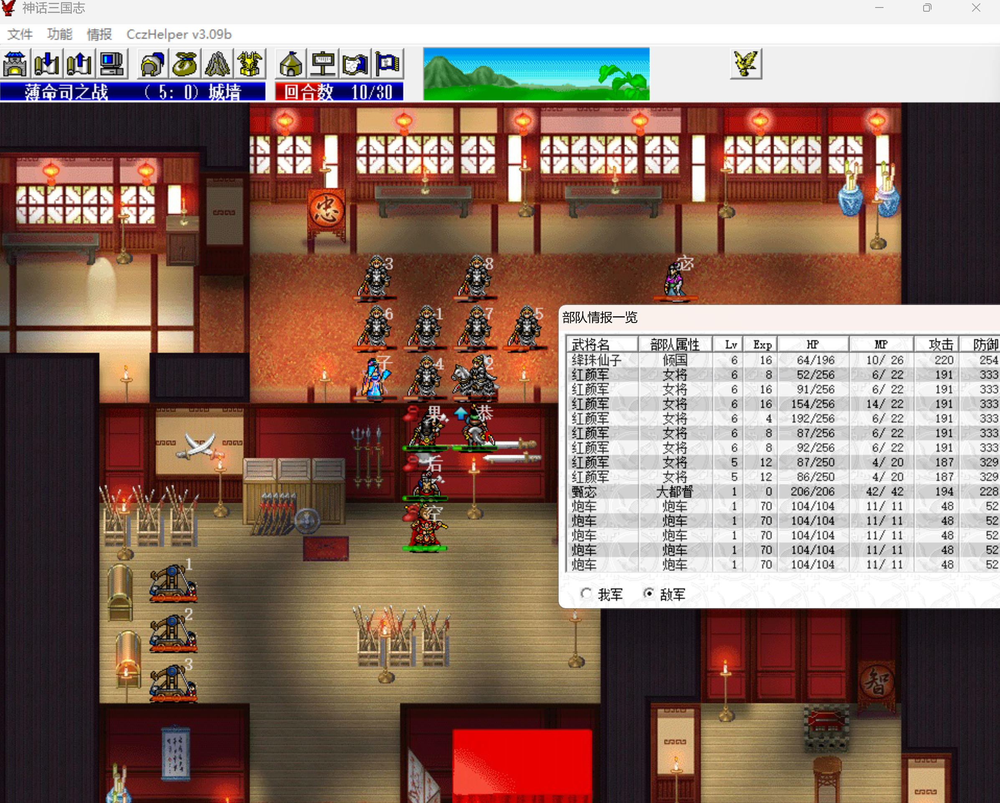
    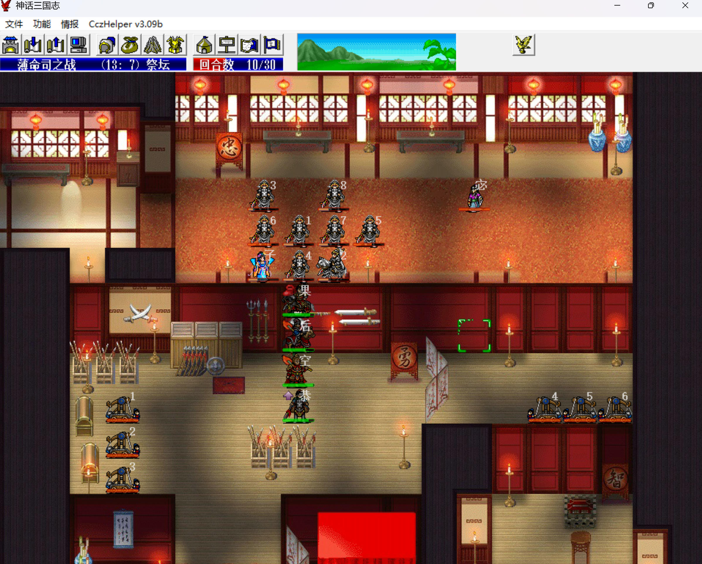

敌军阶段，5号红颜军到1号红颜军上方1格吸血主角失败，至此敌军已呈九宫站位。

|     敌军     | 绛珠 | 1号 | 2号 | 3号 | 4号 | 5号 | 6号 | 7号 | 8号 |
| :----------: | :--: | :-: | :-: | :-: | :-: | :-: | :-: | :-: | :-: |
|  被破甲次数  |  2   |  2  |  2  |  2  |  2  |  1  |  1  |  2  |  2  |
|  可吸血次数  |  1   |  0  |  0  |  0  |  0  |  0  |  0  |  0  |  0  |
| 吸血成功次数 |  1   |  1  |  1  |  0  |  1  |  0  |  1  |  1  |  1  |

第11回合，如法炮制，高长恭上来赚6号红颜军的反击。

敌军阶段，绛珠拉2号红颜军围攻主角，1号红颜军普攻主角，4号红颜军普攻风后。6号红颜军普攻高长恭被破甲反击。

|     敌军     | 绛珠 | 1号 | 2号 | 3号 | 4号 | 5号 | 6号 | 7号 | 8号 |
| :----------: | :--: | :-: | :-: | :-: | :-: | :-: | :-: | :-: | :-: |
|  被破甲次数  |  2   |  2  |  2  |  2  |  2  |  1  |  2  |  2  |  2  |
|  可吸血次数  |  1   |  0  |  0  |  0  |  0  |  0  |  0  |  0  |  0  |
| 吸血成功次数 |  1   |  1  |  1  |  0  |  1  |  0  |  1  |  1  |  1  |

第12回合，一切就绪。高长恭上去攻击5号红颜军，猴哥把7级无缝、玄女兵书换给风后，风后火龙秒9个。

    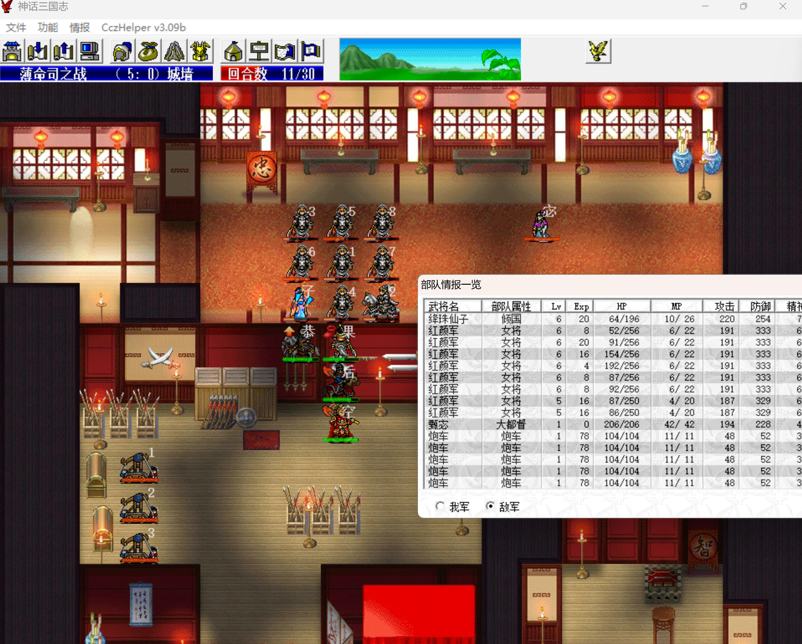
    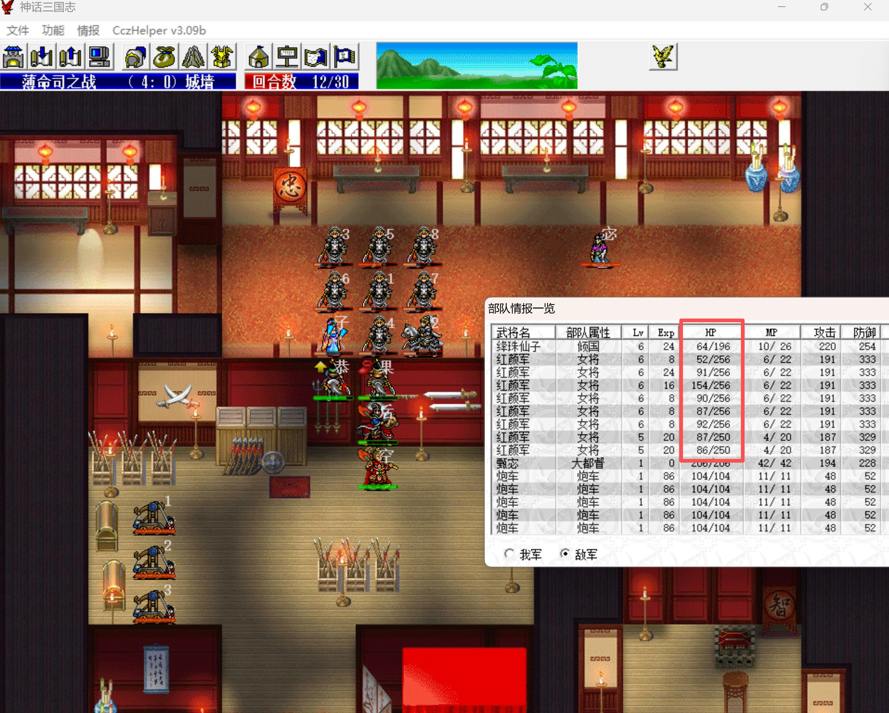
    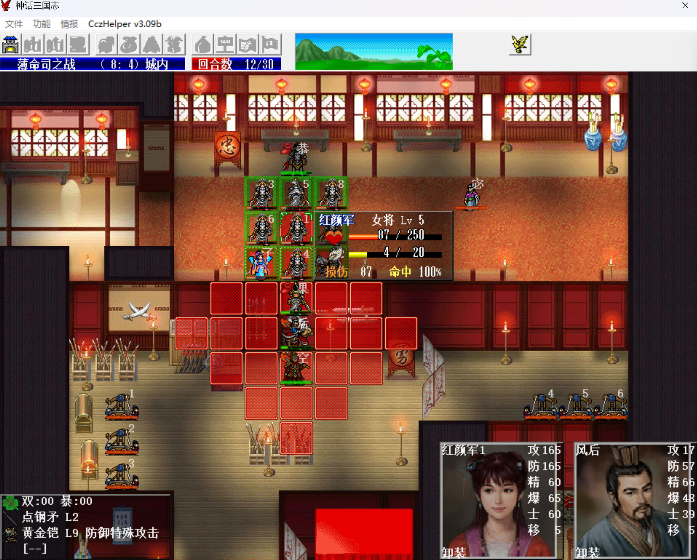

第13回合，高长恭把太极图换给主角得到乾坤圈，主角去右下踩3个城池。

第17回合，3个城池全部踩完，高长恭双击秒掉甄宓（需sl其中一刀暴击，9%的概率），警幻、妲己、褒姒带狐妖出现，妲己被主角挤到城池外面。主角借太极图离开。

    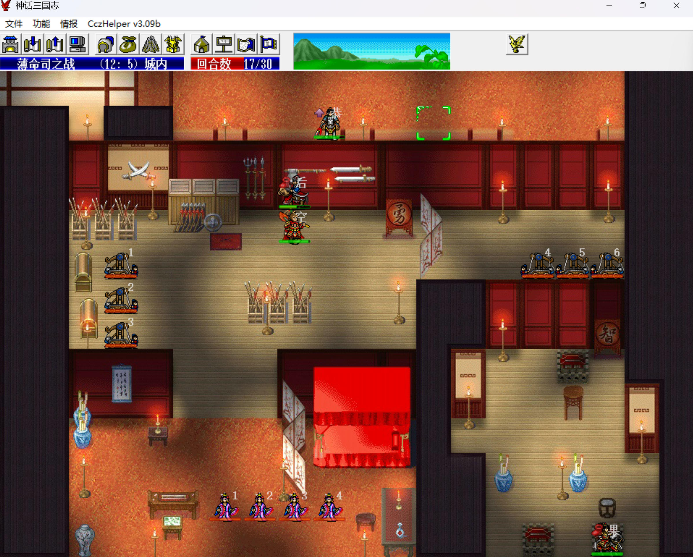
    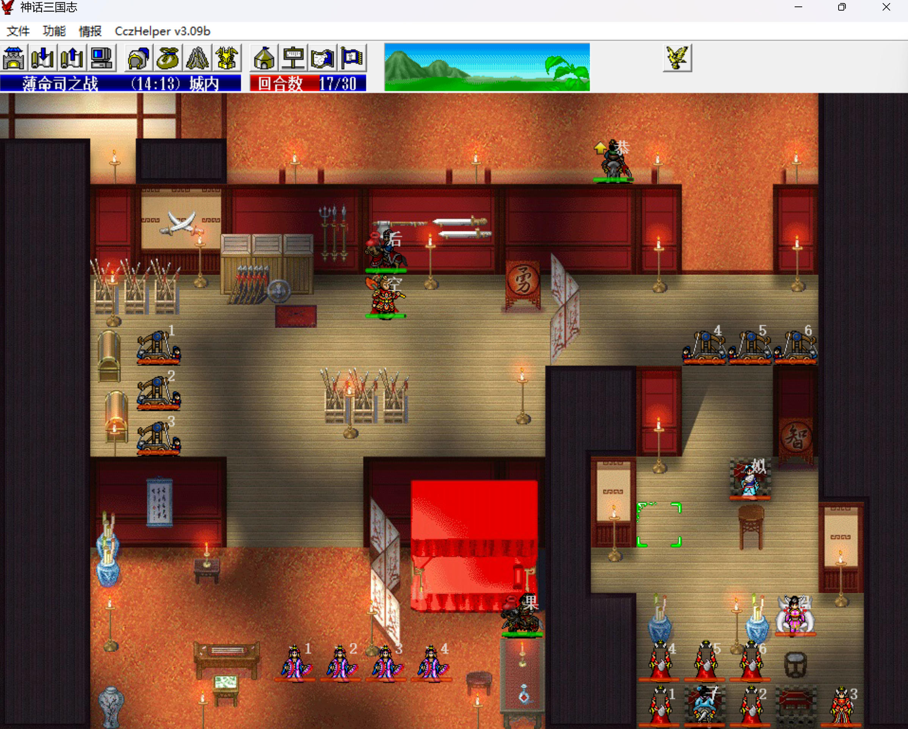

敌军阶段，褒姒大招，右下第二阵不分敌我HP-50。妲己大招，我军混乱、防御debuff。

敌军狐妖全部原地待命（可移动范围搜索不到主角？）

之后主角上来，和风后、猴哥相互交换太极图，爬上墙。

第21回合，狐妖还剩5HP，敌军阶段会被褒姒全灭，而警幻、妲己、褒姒是原地站桩的，没啥威胁。所以主角、风后、猴哥爬墙过来，猴哥最后一个动，借太极图进阵，招出猴毛，猴毛下来秒掉3个炮车。

    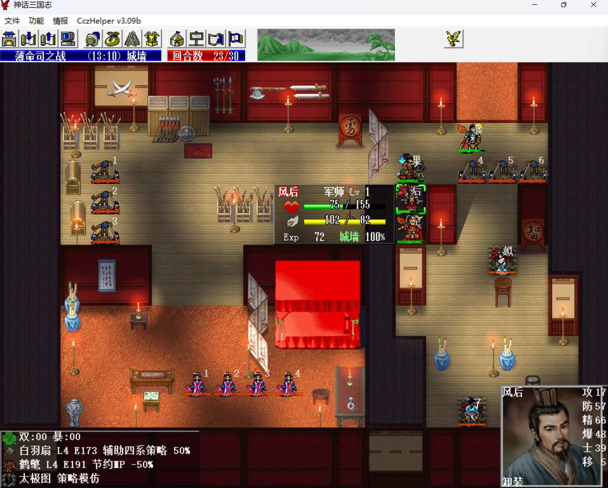
    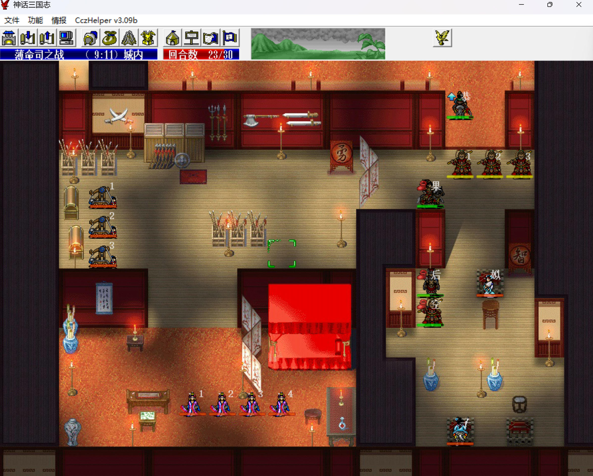

第22回合，sl猴毛、风后最多被混乱两个（主角、猴哥能用醒脑丸解），一个猴毛手榴弹击退妲己，另外两个猴毛手榴弹砸褒姒。

第23回合，猴毛再扔三个手榴弹击退褒姒，风后挑掉警幻（鹤氅、玄女兵书）。

    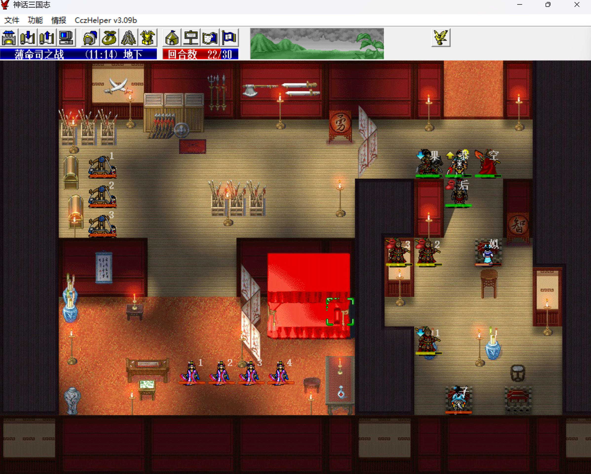
    

侍女猴毛扔两个手榴弹解决，炮车猴毛一下一个。

第27回合，主角进入第三阵，猴哥挑掉元始天尊（金箍棒、无缝、乾坤圈）。

獒犬猴毛扔三个手榴弹解决。

第30回合，击退最后一个敌军过关。如果进第四阵引出穆桂英、白素贞，猴毛要多扔10个手榴弹（1w钱），换经验书多练10回合装备，并不赚，所以放弃。

    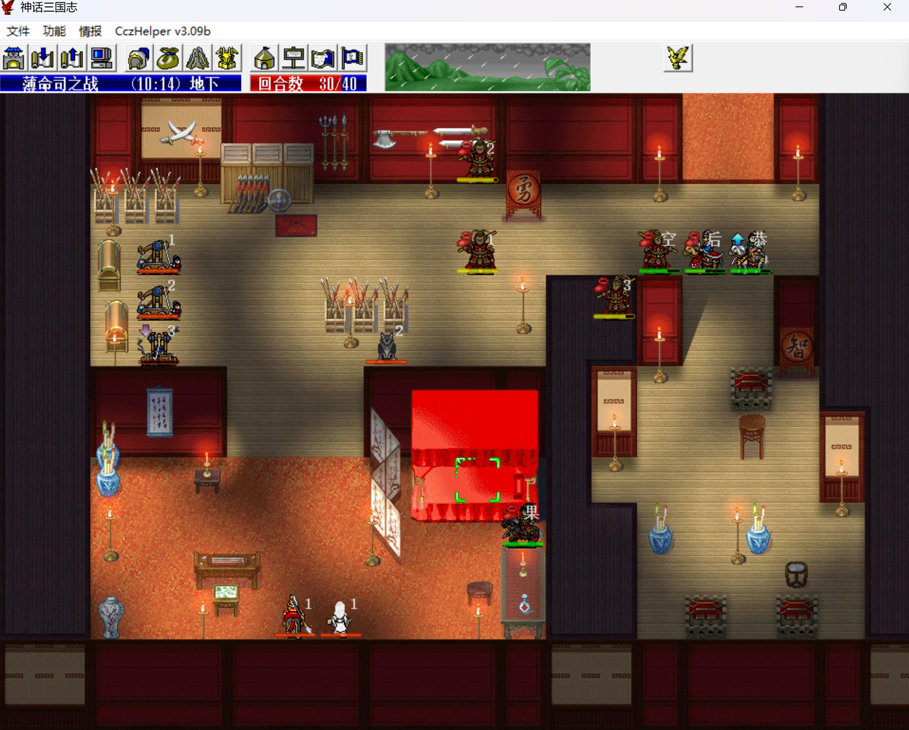
    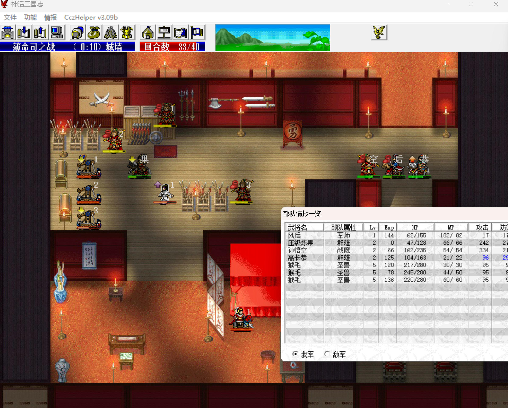

本关：

- 猴哥：手动单挑6级元始得38+2\*4=46点经验，2.20 => 2.66。
- 风后：火龙秒6级红颜军得32+8\*5=72点经验，手动单挑6级警幻得32+8\*5=72点经验，1.0 => 1.144。
- 高长恭：击退第一阵的全部敌军升到5级104

